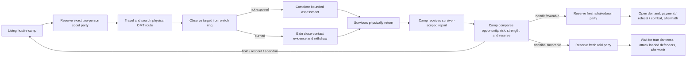
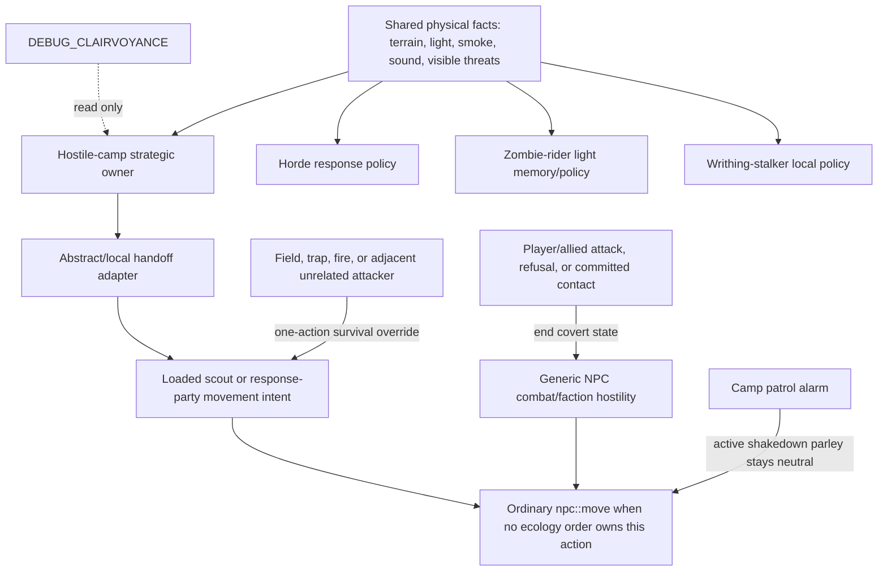

# Bandit and Cannibal Hostile-Camp AI Specification

Status: Refrozen for DE-67 phase 3 after the user-approved R-002 proof rescope.
WEC: `.de67/WEC.md`
Source baseline: `dev@97b8ea09e8d7823c7a4892386b2d77cccf9c3941`, clean before this
documentation-only phase; inspected 2026-08-12.
Comparison baseline: `port/cdda-master` at `660057ff728b`.

This document defines what the feature must do in play, how the implementation is divided between
game systems, and which parts of the inspected `dev` source are complete, partial, or absent. The
current implementation projection is `.de67/work-ledger.md`; this DFS remains normative.

## Document authority and supersession

- `.de67/DFS.md` owns the functional contract, mechanisms, authority, precedence, proof routes, and
  stable red claims. `.de67/work-ledger.md` projects only the current work from those claims.
- `.de67/test-and-task-guidelines.md` and `.de67/orchestrator-guidelines.md` own mutable phase-3
  guidance. `.de67/mutation-suggestions.md` owns the append-only diagnosis and suggestion history.
- Older dated bandit/cannibal packet, audit, and proof documents are implementation archaeology.
  They may explain why a seam exists, but they cannot add requirements, declare success, or
  override this contract and current source evidence.
- `TechnicalTome.md` is chronological mechanic history, not a second current-state specification.
  If its historical wording conflicts with this file, this file and the inspected game path win.
- Do not recreate a parallel roadmap. Close a claim only after accepted evidence and the phase-3
  mutation guard validates the exact status transition, then remove its projection from the work
  ledger.

Status markers:

- `[x]` is present in the game path and has proportionate source/test evidence.
- `[ ] 🔴 R-NNN —` is a stable wrong, incomplete, or unproved primary claim. When accepted, change
  only that marker to `[x] R-NNN —` through the phase-3 mutation guard.
- A unit-tested state structure is not considered implemented if no production game path invokes it.

### Evidence-bound amendment and refreeze policy

Failed production evidence may add or clarify a stable red claim only when deleting the amendment
would leave the requested outcome unclassified or unprovable. During implementation, non-material
evidence and proof refinements may be recorded and refrozen. Material behavior, geometry, balance,
or authority choices return to the user through DE-67 phase 2 for a fresh specification pass.
No refinement may weaken the requested outcome or legitimize an implementation shortcut.

## Functional contract

A naturally generated bandit or cannibal camp is a persistent physical faction. It sends a
two-person scout party to explore and scavenge, learns only what the scouts can plausibly perceive,
withdraws coherently when discovered, receives only information carried home by survivors, and
decides whether it has enough strength and opportunity to act. A favorable bandit decision creates
a new shakedown party. A favorable cannibal decision creates a new attack party which waits for
true darkness. Neither faction knows the avatar's coordinates or camp contents by fiat.

Routine scouts travel on foot in this version. Vehicle transport, boarding, routing, fixtures, and
future vehicle compatibility are outside this DFS. A local/abstract scout handoff clears impossible
passenger or driver state instead of adding or preserving vehicle behavior.

The player-facing success path is:



## Required behavior and current implementation

### 1. Camp, roster, and dispatch ownership

- [x] Bandit and cannibal camps use the same routine exploration machinery. Cannibals do not need
  a separate supernatural hunt trigger.
- [x] Routine scouts are exactly two people. A one-person camp cannot dispatch; a two-person camp
  sends both; larger camps send two while retaining an at-home reserve where their roster permits.
  The number two is the agreed product rule, not a tuning guess.
- [x] The camp owns one serialized roster whose members are unambiguously at home, reserved,
  outbound, materialized, returning, dead, missing, or retired. A member cannot be simultaneously
  available to camp jobs and an outing.
- [x] Routine scouting, returned assessment, and hostile response are different operations with
  stable IDs, generations, reservation members, and idempotent application keys. A scout mission
  does not silently turn into a raid.
- [x] A camp has at most one active external operation. A response cannot reserve members while a
  scout or another response still owns outside pressure for that camp.
- [x] A deterministic surviving member replaces a dead leader; the pair retains its shared route
  and operation identity.

### 2. World truth, private knowledge, and bounty

- [x] Finite structural/ground bounty is global world truth. Each camp stores only its private,
  possibly stale estimate. Two camps may believe a site is rich, but only the first valid claimant
  consumes its remaining resource.
- [x] Bandit and cannibal scouts both search for and collect finite bounty as part of routine
  scouting.
- [x] Camp leads carry provenance, observation time, confidence/uncertainty, threat, bounty,
  approximate position, and aging. Active operations pin referenced evidence so ordinary pruning
  cannot invalidate a live mission.
- See `R-008`: player-camp opportunity is not yet a renewable authoritative value. Repeated
  shakedowns require both the existing cooldown and genuinely renewed camp value from stored goods,
  population, or activity; a timer alone cannot regenerate loot or authorize repeated demands.

### 3. Perception and discovery

- [x] The production branch's exact-avatar radar (`direct_player_range`, ten OMTs) is absent from
  the active `dev` path. The remaining `legacy_radar` value is compatibility vocabulary for old
  saves, not a live sensor.
- [x] Scouts acquire facts only from a bounded route/frontier query. The ordinary baseline is
  roughly three OMTs in clear day, two in degraded light/dusk, and one in unlit night, with terrain,
  weather, elevation, optics, and the actual NPC's sight affecting the result. These numbers are
  the agreed visibility rule.
- [x] Optics improve credible observation and assessment; they do not grant arbitrary map-wide
  player or camp tracking.
- [x] Smoke, visible light, searchlights, alarms, gunfire, and explosions create approximate leads.
  A signal may cause investigation, but it does not reveal the avatar's identity, exact inventory,
  or current coordinates.
- [x] Terrain supplies a prior danger cost. Live hostile population is sampled only where a scout
  can legitimately observe it; the camp does not query unseen zombie populations as omniscient
  route data.
- [x] Danger has soft and hard effects: risk can increase route cost, while an observed overwhelming
  threat can reroute, abort, or force immediate self-defense.
<!-- DE67:DFS-SLICE:BEGIN id=R-002-S001 claim=R-002 -->
- [ ] 🔴 R-002 — Ordinary-play bounded-discovery fairness and absence of hidden-state radar remain
  unproved through focused owner tests plus the smallest changed-executable negative/positive
  production proof named below.
<!-- DE67:DFS-SLICE:END id=R-002-S001 claim=R-002 -->

### 4. Physical movement, stalking, and exposure

- [x] The strategic operation has one simulation owner at a time: abstract overmap or local loaded
  NPCs. Handoff epoch and generation checks reject stale or duplicate advancement.
- Routine scouts are on foot for their entire operation. The handoff adapter must bind them as
  on-foot NPCs with `in_vehicle == false` and `controlling_vehicle == false`; no vehicle-aware branch
  is required or permitted by this version.
- [x] A scout pair has a leader, escort, common route, assigned staging tiles, cohesion rules,
  regroup behavior, bounded recovery, and casualty-aware continuation.
- [x] The target camp footprint and a watch position remain distinct. Normal stalking observes from
  a three-OMT radius—two empty OMTs between the scouts and the camp—and falls farther back when
  terrain or exposure requires it.
<!-- DE67:DFS-SLICE:BEGIN id=R-003-S001 claim=R-003 -->
- [x] Reciprocal ordinary visual contact burns the party. Being burned adds useful close-contact
  evidence and target alertness, then commits the scouts to egress. It is not deliberately farmed
  as a scouting tactic.
- [x] While searching, watching, or withdrawing covertly, scouts are neutral to the player and
  allied defenders. Generic faction hostility and misleading “gets angry” presentation resume only
  after attack, refusal/escalation, or committed combat.
- [x] A burned party has a persistent route out of the target OMT. It is not constrained to pace
  between adjacent visible tiles while its strategic owner wants to leave.
- [ ] 🔴 R-003 — Burned-pair evidence, coherent egress, covert neutrality, and identity continuity
  remain unproved through the natural visible-pair route and its quiet control.
<!-- DE67:DFS-SLICE:END id=R-003-S001 claim=R-003 -->
- [x] R-001 — The natural local-to-abstract return handoff is not complete. `T01-M1` through
  `T01-M5` preserved generation-1 members 4/5 and the unchanged McWilliams route while moving the
  frontier past safe boundary selection, asymmetric pair travel, and recenter visibility.
  Checkpoint `0d082eda34` bounds the homeward pair; `7495ec5286` exposes the materialization gate.
  The current handoff must retain the observing-produced physical resume until its homeward
  consumer and bind both scouts on foot with impossible vehicle state cleared. `T01-M5` was stopped
  before acceptance when its candidate added out-of-scope vehicle preservation. The same natural
  route must still complete physical crossing, camp dematerialization, canonical return, report,
  and decision; the incident chronology remains in `.de67/mutation-suggestions.md`.

### 5. Report, assessment, and response decision

<!-- DE67:DFS-SLICE:BEGIN id=R-004-S001 claim=R-004 -->
- [x] A camp learns no useful target dossier until a survivor physically returns. Two dead scouts
  yield only overdue/missing state. One survivor yields a partial/provisional report restricted to
  evidence available to that survivor; a later survivor may revise it.
- [x] Reports identify their source operation, member(s), evidence revisions, timestamps, target,
  uncertainty, defender bounds, coarse visible equipment, opportunity cues, route risk, exposure,
  and losses. Applying the same return/report/cargo packet twice is a no-op.
<!-- DE67:DFS-SLICE:END id=R-004-S001 claim=R-004 -->
<!-- DE67:DFS-SLICE:BEGIN id=R-005-S001 claim=R-005 -->
- [x] Camp assessment compares pessimistic target strength, uncertainty, alertness, route risk,
  opportunity, ready camp power, and the required home reserve. It may hold, rescout, abandon, or
  prepare one faction-specific follow-on.
- [x] A follow-on response selects and reserves a fresh party from current survivors rather than
  reusing the scout reservation. The current planner preserves the report revision and operation
  generation.
<!-- DE67:DFS-SLICE:BEGIN id=R-004-S002 claim=R-004 -->
- [x] R-004 — Dead, missing, and split-survivor knowledge, report revision, and mission-slot
  release remain unproved through the natural authoritative death and return routes.
<!-- DE67:DFS-SLICE:END id=R-004-S002 claim=R-004 -->
- [x] R-005 — The production scheduler never calls `plan_hostile_operation`; current calls are confined
  to tests. `transition_hostile_operation_phase` is likewise exercised by tests and origin-recall
  cleanup, not by a complete live response lifecycle. The follow-on owner is therefore scaffolding,
  not an implemented player-facing feature.
<!-- DE67:DFS-SLICE:END id=R-005-S001 claim=R-005 -->

### 6. Faction-specific consequences

<!-- DE67:DFS-SLICE:BEGIN id=R-006-S001 claim=R-006 -->
Bandits and cannibals share exploration and assessment. They diverge only after a returned report
authorizes a response.

- [x] R-006 — **Bandit shakedown:** reserve a fresh response party, travel physically, rally outside the
  camp at a plausible two-to-three-OMT planning distance, approach openly, suppress premature
  patrol combat, demand a share of currently reachable camp storage, and resolve payment, refusal,
  player attack, withdrawal, casualties, and return.
  The parley-neutrality hook exists, but no natural scout-to-shakedown run proves the lifecycle.
<!-- DE67:DFS-SLICE:END id=R-006-S001 claim=R-006 -->
<!-- DE67:DFS-SLICE:BEGIN id=R-007-S001 claim=R-007 -->
- [x] R-007 — **Cannibal raid:** reserve a fresh attack party sized against pessimistic camp strength,
  travel physically, rally in concealment at a plausible two-to-three-OMT planning distance, wait
  for true local darkness, and attack the avatar plus all loaded camp defenders. Cannibals never
  open the payment interface. No invisible offscreen defender deaths are permitted. The state
  vocabulary exists, but the live lifecycle is not wired or proved.
<!-- DE67:DFS-SLICE:END id=R-007-S001 claim=R-007 -->
<!-- DE67:DFS-SLICE:BEGIN id=R-008-S001 claim=R-008 -->
- [ ] 🔴 R-008 — Aftermath must update the attacking camp's casualties, readiness, target alertness,
  outcome memory, payment/plunder, and future eligibility. A bandit may repeat only after cooldown
  plus renewed target opportunity; a cannibal may reassess survivors rather than replaying an
  obsolete report.
<!-- DE67:DFS-SLICE:END id=R-008-S001 claim=R-008 -->
- [x] Autonomous inter-camp war is outside this version. Other hostile camps contribute route risk;
  they do not trigger a second unspecced faction-war simulation.

<!-- DE67:DFS-SLICE:BEGIN id=R-009-S001 claim=R-009 -->
### 7. Persistence, performance, and proof

- [x] Camps, private leads, finite resources, outings, reservations, reports, decisions, casualties,
  ownership epochs, and application watermarks have serialization and focused compatibility tests.
- [x] `DEBUG_CLAIRVOYANCE` provides a read-only ecology view, selection, bounded watches, compact
  deltas, incident capture, and one labelled casualty intervention through the authoritative death
  route. The observer is not a gameplay owner.
- [ ] 🔴 R-009 — Save/load at each live lifecycle boundary—including local/abstract handoff, split return,
  shakedown contact, and cannibal darkness wait—must be proved with the changed executable.
<!-- DE67:DFS-SLICE:END id=R-009-S001 claim=R-009 -->
<!-- DE67:DFS-SLICE:BEGIN id=R-010-S001 claim=R-010 -->
- [ ] 🔴 R-010 — Mac performance/save measurements for the observer and early ecology are not final
  qualification for the completed feature. Before integration, measure the full production path
  on macOS, Linux/WSL, and Windows, including scheduler cost, loaded-NPC cost, save-size growth, and
  save/load latency. Do not run global work every avatar turn merely to satisfy a test.
- See `R-010`: release qualification remains blocked until the natural scout-to-decision incident,
  bandit shakedown, cannibal night raid, persistence boundaries, and relevant platform routes are
  green. `port/cdda-master` remains untouched meanwhile.
<!-- DE67:DFS-SLICE:END id=R-010-S001 claim=R-010 -->

## Competing AI systems and override direction

The feature does not replace CDDA NPC AI. It supplies a strategic owner and a narrow movement
intent while an ecology operation is active. Existing survival and combat owners keep precedence
where their facts are more immediate.



### Ownership and precedence table

| Situation | Authoritative owner | Override rule |
|---|---|---|
| Camp memory, dispatch eligibility, report, decision, reservation | `bandit_live_world` strategic state | No generic NPC behavior may create or advance these facts. |
| Unloaded travel/search/watch/return | Abstract outing cursor | Only the matching operation generation and owner epoch advances. |
| Materialization/dematerialization | `do_turn.cpp` handoff adapter plus overmap NPC storage | Commit one physical boundary crossing before abstract ownership resumes; transfer atomically and never let local and abstract loops move the same member. |
| Loaded route/cohesion/egress | Ecology movement intent for the exact reserved members | Choose only a route-reachable paired physical transition on actual loaded geometry. If none is available, retain or replan ownership without movement, progress, or outcome credit. |
| Fire, field, trap, impassable tile, adjacent unrelated threat | Existing immediate-survival/combat behavior | May preempt one action without deleting the strategic route or inventing a phase transition. |
| Player/allied attack, bandit refusal, committed raid/contact | Existing NPC combat and faction attitude | Explicitly terminates covert neutrality; combat becomes authoritative until contact resolves. |
| Generic faction hostility during covert stalking | Derived covert relationship in `npc::attitude_to` | Suppress hostility only for active, correctly targeted ecology members; never persist a fake faction change. |
| Player-camp patrol during bandit parley | Camp patrol AI | Treat only the active shakedown party as neutral until escalation. Other hostiles remain hostiles. |
| Ordinary inactive NPC travel | Existing `overmap_npc_move` / NPC `omt_path` | Must yield for members owned by an active ecology operation to prevent double travel. |
| Ordinary loaded NPC needs, missions, behavior tree, and optional LLM intent | Existing `npc::move` path | The exact reserved member's valid ecology order owns that action first; ordinary AI resumes when no ecology order applies or covert state ends. LLM output never creates strategic ecology truth. |
| Debug UI/harness | Read-only observer and labelled authoritative casualty intervention | May reveal state or kill a selected member through the real death route; may not set discovery, phase, report, decision, payment, or raid outcome. |

`bandit_dry_run` and `bandit_pursuit_handoff` are also potential duplicate owners inside the
feature. Their permitted roles are deliberately narrow: `bandit_dry_run` may evaluate or explain a
candidate, and `bandit_pursuit_handoff` may validate/transport a transition packet. Neither owns a
second camp memory, reservation, lifecycle clock, or result. Persisted truth remains in
`bandit_live_world` and the normal NPC/overmap stores.

### Authoritative return-boundary transition

The returning outing has exactly one movement owner. While its members are loaded, the local owner
may not return, move toward, or credit an unreachable boundary pair. It must either choose a
route-reachable paired physical boundary transition on the actual loaded geometry, or retain and
replan ownership without physical movement, route/ownership progress, or
return/report/decision credit. The chosen transition remains subject to the existing nonreentry
rule.

Abstract outing ownership resumes only from the matching committed physical crossing. The transfer
must preserve the same camp, outing, generation, epoch, and surviving member identities and must
not use teleportation, geometry edits, direct actor-path assignment, a duplicate movement owner,
or an abstract-return shortcut. Canonical camp dematerialization, survivor return, final report,
and decision remain downstream production transitions, not credit implied by selecting a boundary.

If the currently loaded boundary cannot supply a route-reachable paired transition, the ownership
design is red; the map is not thereby authorized to change. Production proof must discriminate a
valid alternate or recentered ownership transfer from genuine physical entrapment on the unchanged
world. A failed transfer must remain inert and may classify the obstruction, but may not manufacture
success.

### Shared primitives versus separate policies

Hordes, zombie riders, writhing stalkers, bandits, and cannibals may consume the same physical
emitter primitives. They must not share behavioral memory or ownership merely because they noticed
the same event.

| Primitive or state | Bandit/cannibal camps | Hordes | Zombie riders | Writhing stalkers |
|---|---|---|---|---|
| Physical light/smoke/sound observation | Shared input | Shared input | Shared input | Shared input where its local/overmap contract permits |
| Terrain and ordinary visibility | Shared engine primitive | Own policy | Own policy | Own policy |
| Camp intelligence map / dossiers | Own, private per camp | Never | Never | Never |
| Finite bounty and shakedown value | Own hostile-camp system | Never | Never | Never |
| Scout/report/response reservations | Own hostile-camp system | Never | Never | Never |
| Movement and reality-bubble handoff | Exact camp-operation members only | Existing horde owner | Rider owner | Stalker owner |
| Debug projection | May share observer presentation | May be displayed | May be displayed | May be displayed |

Direction: introduce or retain a small read-only **physical observation** interface at the producer
boundary, then let each consumer decide what it means. Do not introduce a universal “ecology AI”
brain, universal target registry, shared pursuit memory, or generic phase setter. For any actor that
could be claimed by two movement systems, the deciding key is the actor's stable identity plus the
active owner's generation/epoch; the loser yields without mutating the winner's state.

## Conformance summary: `dev` versus `port/cdda-master`

What is right in `dev`:

- [x] It removes the production branch's ten-OMT avatar radar and replaces it with bounded,
  provenance-bearing perception.
- [x] It creates persistent private camp knowledge, global finite-resource truth, two-person
  scouting, stable reservations, abstract/local ownership, cohesive movement, exposure egress,
  survivor-scoped reports, camp assessment, and honest observer tooling.
- [x] It separates a returned scouting operation from a fresh hostile response operation and keeps
  bandit/cannibal consequences distinct at the policy level.
- [x] It adds derived covert neutrality instead of permanently editing faction relations, and it
  gives camp patrols a narrow shakedown-parley exception.

What is incomplete or currently wrong:

- `R-001`: the local owner still returns a known-unreachable boundary pair instead of committing a
  reachable physical crossing or retaining/replanning ownership inertly.
- `R-005`: the fresh hostile-operation planner and phase machine are not invoked by the production
  scheduler, so bandit and cannibal consequences remain test-only scaffolding.
- `R-008`: renewable player-camp opportunity and complete aftermath/repeat rules are absent.
- `R-009` and `R-010`: full live save/load, performance/save-growth, and three-platform
  qualification remain open and must follow the completed gameplay path rather than isolated helper
  success.

## Acceptance ledger

The feature is complete when these user-visible contracts are crossed off with changed-executable
evidence. Except for the user-rescoped R-002 route below, focused tests may support a row but cannot
replace its stated live route.

- `R-001`: one natural bandit camp dispatches its exact pair, watches or burns, commits a
  route-reachable paired physical boundary crossing on unchanged geometry, physically returns at
  least one survivor, applies a final report, and enters the matching camp decision without a
  teleported or abstract-jump return.
- `R-003`: a burned visible pair gains evidence, exits the target OMT without dancing or false anger,
  and preserves its route/report identities.
- `R-004`: killing both scouts prevents an informed response; one survivor produces only a partial
  report; a later survivor revises rather than duplicates it.
- `R-006`: a decided bandit response reserves a fresh party, reaches the camp, performs a real
  shakedown, and resolves payment, refusal/combat, return, and aftermath.
- `R-007`: a decided cannibal response reserves a fresh party, waits for true darkness, attacks all
  loaded defenders without a payment UI, and causes no offscreen defender deaths.
- `R-008`: two camps cannot double-harvest one finite site; a repeated bandit shakedown requires
  cooldown plus demonstrably renewed player-camp opportunity.
- `R-002`: focused owner tests cover clear day/dusk/unlit night, forest/weather/optics, signal
  uncertainty, target relocation, and unseen-versus-observed danger invariants. The smallest live
  negative/positive production proof establishes that quiet play inside the old radar radius stays
  undiscovered; a credible real signal can be discovered without a decoy granting exact hidden
  player truth; relocation does not drag stale target knowledge; and unseen danger does not affect
  routing until legitimately observed.
- `R-009` and `R-010`: save/load preserves authority and causality at every phase; full-feature
  performance and save growth remain acceptable on macOS, Linux/WSL, and Windows.

## Proof routes for remaining claims

Focused proof may isolate an authoritative seam, but only the named natural or integrated route can
close a claim that requires player-facing production behavior. Evidence must preserve the exact
source, binary, fixture, scenario, camp, operation, generation, epoch, and member identities that
matter to the verdict. Incidental artifact metadata is not part of a verdict unless it can change
identity, the claim result, or a false-green control. R-002 is the user-approved exception to a
bespoke natural-world route and exact continuity for every matrix row: its focused owner tests own
the invariant matrix, while one smallest live negative/positive production proof needs only enough
source/build/scenario provenance and causal observations to exclude a stale binary, setup-only
artifact, hidden-state injection, or another false green.

### R-001 — Natural local-to-abstract return

```text
proof(R-001) =
  preconditions: exact committed source/binary; unchanged natural McWilliams fixture, geometry,
                 scenario timing, camp, outing generation, members, and zero intervention
  -> authoritative owner: matching-generation local ecology movement plus the single
                          local/abstract handoff adapter
  -> transition: choose a route-reachable paired physical boundary transition on the actual loaded
                 geometry and commit it before atomically resuming the matching abstract outing;
                 otherwise retain/replan ownership inertly
  -> observable fact: same identities physically cross together, dematerialize at camp, apply a
                      canonical surviving return and eligible final report, and enter the matching
                      authoritative decision; or remain explicitly non-credit with an obstruction
                      classification that distinguishes alternate/recentered transfer from genuine
                      entrapment
  -> artifact: identity-bound boundary selector plus compact incident JSON and paired screenshot
               where UI state matters, with source/binary/fixture/scenario/run hashes
  -> pass/fail: pass only on the ordered production chain; fail on an unreachable selected pair,
                movement/progress/outcome credit without crossing, identity mismatch, duplicate
                owner, geometry/timing mutation, teleport, direct path assignment, abstract-return
                shortcut, or an unclassified retained stall
```

The integrated proof is the unchanged natural
`bandit.scout_to_decision_observer_live_mcw` incident on the exact accepted committed binary. It
must show paired physical boundary crossing -> camp dematerialization -> canonical surviving return
-> eligible final report -> matching authoritative decision in one identity chain. The focused
owner proof must make the known unsafe-selection control fail, show a reachable paired transition
crossing without violating nonreentry, and show that no valid current transition retains or replans
without physical movement, route/ownership progress, or outcome credit.

### R-002 through R-010

<!-- DE67:DFS-SLICE:BEGIN id=R-002-S002 claim=R-002 -->
- `R-002`: focused owner tests exercise `structural_observer_omt_sight_range`,
  `structural_observer_route_is_visible`, structural signal validation/retention, local-zombie
  eligibility and observation, returned-report lead ownership, and avatar-relocation non-ownership.
  They cover clear day, dusk, and unlit night; road through forest/weather with and without optics;
  credible real signal versus decoy uncertainty; relocation; and unseen versus legitimately
  observed zombie danger. The smallest live negative/positive changed-executable proof then shows,
  through the ordinary `overmap_npc_move` -> structural maintenance path, all four causal controls:
  quiet play inside the former radar radius creates no discovery; a credible real signal can create
  an approximate lead while a decoy cannot grant exact avatar, inventory, defender, storage, or
  hidden-danger truth; moving the avatar does not move an existing target lead; and route choice is
  unchanged by unseen danger until an ordinary bounded observation records it. The proof may reuse
  one compact scenario and the minimum identities needed to distinguish those transitions; it does
  not require a bespoke natural-world certification run, fixture, operation, or member-identity
  chain for every invariant row.
<!-- DE67:DFS-SLICE:END id=R-002-S002 claim=R-002 -->
<!-- DE67:DFS-SLICE:BEGIN id=R-003-S002 claim=R-003 -->
- `R-003`: one natural visible-burn incident plus a quiet, unattacked control distinguishes burned
  evidence and committed egress from ordinary covert neutrality. It must show no pacing, false
  anger, or route/report identity replacement.
<!-- DE67:DFS-SLICE:END id=R-003-S002 claim=R-003 -->
<!-- DE67:DFS-SLICE:BEGIN id=R-004-S003 claim=R-004 -->
- `R-004`: both scouts dead yields no informed response and no wedged slot; one survivor yields a
  partial/provisional report; and a later survivor revises rather than duplicates it. Stable
  operation, member, and report identities and authoritative deaths are required.
<!-- DE67:DFS-SLICE:END id=R-004-S003 claim=R-004 -->
<!-- DE67:DFS-SLICE:BEGIN id=R-005-S002 claim=R-005 -->
- `R-005`: a focused owner control rejects stale or duplicate generations and reuse of the scout
  reservation. A changed-executable incident naturally turns the matching final decision into one
  fresh response and advances it through its first production transition, with one strategic owner
  and no LLM-created ecology truth.
<!-- DE67:DFS-SLICE:END id=R-005-S002 claim=R-005 -->
<!-- DE67:DFS-SLICE:BEGIN id=R-006-S002 claim=R-006 -->
- `R-006`: one paid branch and one refusal-or-attack branch distinguish real demand/payment from
  premature combat and escalation/combat/return from dialogue-only success. Both physically rally,
  close casualties and survivors, return, and write back exactly once; teleportation, invisible
  payment, broad patrol neutrality, and missing replay-safe closure fail.
<!-- DE67:DFS-SLICE:END id=R-006-S002 claim=R-006 -->
<!-- DE67:DFS-SLICE:BEGIN id=R-007-S002 claim=R-007 -->
- `R-007`: a pre-darkness hold and a later true-dark attack in the same causal route distinguish
  darkness policy from elapsed-time attack. The incident engages the avatar and all loaded
  defenders, exposes no payment UI, causes no offscreen defender death, physically reconciles
  survivors and casualties, and contains no bandit-policy leakage or debug-triggered contact.
<!-- DE67:DFS-SLICE:END id=R-007-S002 claim=R-007 -->
<!-- DE67:DFS-SLICE:BEGIN id=R-008-S002 claim=R-008 -->
- `R-008`: two camps contesting one site distinguishes global consumption from duplicated private
  belief. Repeat attempts before and after real stored-goods, population, or activity renewal
  distinguish cooldown-only replay from renewed opportunity. Faction aftermath applies exactly
  once; timer-created value, stale-report replay, and duplicate writeback fail.
<!-- DE67:DFS-SLICE:END id=R-008-S002 claim=R-008 -->
<!-- DE67:DFS-SLICE:BEGIN id=R-009-S002 claim=R-009 -->
- `R-009`: one save/reload at each named boundary—local/abstract handoff, split return, shakedown
  contact, and cannibal darkness wait—preserves generation, epoch, member, and application identity
  and resumes through production. Schema-only or raw-save-rewrite evidence does not close it.
<!-- DE67:DFS-SLICE:END id=R-009-S002 claim=R-009 -->
<!-- DE67:DFS-SLICE:BEGIN id=R-010-S002 claim=R-010 -->
- `R-010`: the same completed production path has named CPU/scheduler, retained-memory,
  save-size/load-latency, runtime, and packaging evidence on macOS, Linux/WSL, and Windows. Final
  promotion uses the reviewed orchestrator route and requires fresh explicit authority before
  touching `port/cdda-master`; no red predecessor may remain. It adds no generic final live run,
  adversarial review, or full-diff review beyond the explicitly named specification and platform
  proofs.
<!-- DE67:DFS-SLICE:END id=R-010-S002 claim=R-010 -->

### Proof integrity

Staged setup ends before the asserted behavior. No helper, mock, raw-save transform, debug setter,
teleport, handwritten artifact, or test-only code may manufacture gameplay credit. The transition
comes from the authoritative production owner, and positive or negative controls exist only when
they distinguish the claimed mechanism.

## Freeze record

- Status: Refrozen
- Frozen source baseline: `dev@97b8ea09e8d7823c7a4892386b2d77cccf9c3941`; the worktree was clean
  before `.de67/WEC.md` was imported and this DFS was rescoped on 2026-08-12.
- User-owned choice: preserve R-002's bounded-real-perception behavior and rescope only its proof
  burden as stated verbatim in `.de67/WEC.md`; leave R-001 and R-003 through R-010 product
  requirements unchanged.
- Evidence-implied refinements: none.
