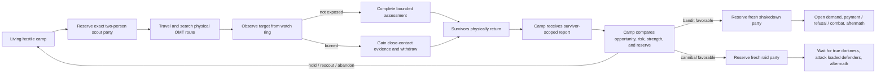
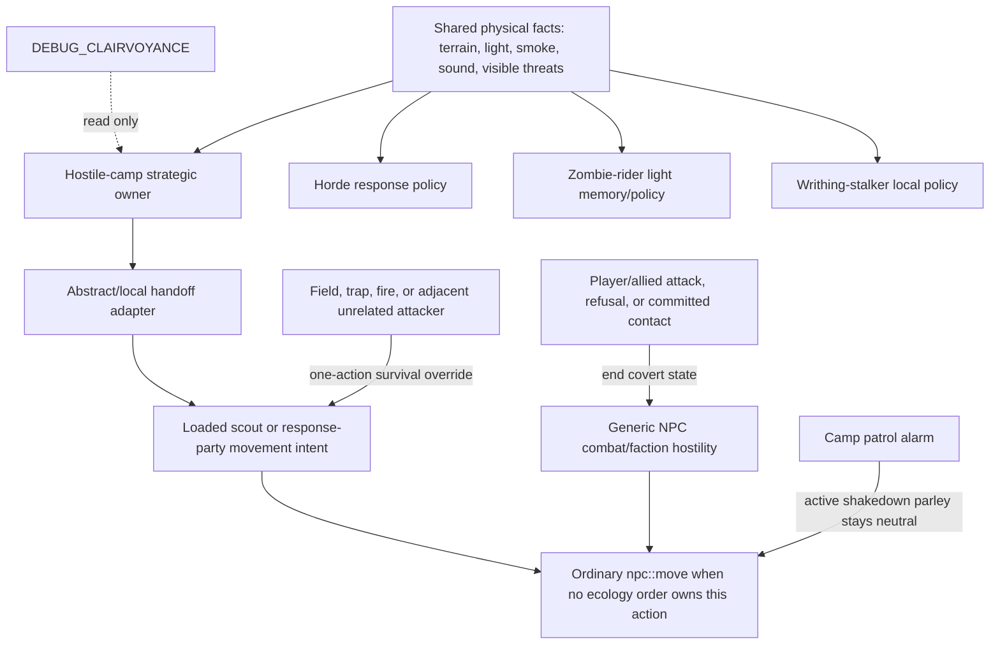

# Combined Hostile-Camp AI and Harness Registry Specification

Status: Refrozen combined successor for DE-67 phase 3.
WEC: `.de67/WEC.md`
Source baseline: `dev@038c2e9e60b39572db864ed7465a618e08e8ba6f` with the preserved hostile-
ecology/harness frontier listed in the freeze record; inspected 2026-08-15.
Comparison baseline: `port/cdda-master` at `660057ff728b`.

This document defines what the feature must do in play, how the implementation is divided between
game systems, and which parts of the inspected `dev` source are complete, partial, or absent. The
current implementation projection is `.de67/work-ledger.md`; this DFS remains normative.

## Document authority and supersession

- `.de67/DFS.md` owns the functional contract, mechanisms, authority, precedence, proof routes, and
  stable red claims. `.de67/work-ledger.md` projects only the current work from those claims.
- `.de67/test-and-task-guidelines.md` and `.de67/orchestrator-guidelines.md` own mutable phase-3
  guidance. `.de67/mutation-suggestions.md` owns the append-only diagnosis and suggestion history.
- Older dated bandit/cannibal packet, audit, and proof documents are implementation archaeology.
  They may explain why a seam exists, but they cannot add requirements, declare success, or
  override this contract and current source evidence.
- `TechnicalTome.md` is chronological mechanic history, not a second current-state specification.
  If its historical wording conflicts with this file, this file and the inspected game path win.
- Do not recreate a parallel roadmap. Close a claim only after accepted evidence and the phase-3
  mutation guard validates the exact status transition, then remove its projection from the work
  ledger.

Status markers:

- `[x]` is present in the game path and has proportionate source/test evidence.
- `[ ] 🔴 R-NNN —` is a stable wrong, incomplete, or unproved primary claim. When accepted, change
  only that marker to `[x] R-NNN —` through the phase-3 mutation guard.
- A unit-tested state structure is not considered implemented if no production game path invokes it.

### Evidence-bound amendment and refreeze policy

Failed production evidence may add or clarify a stable red claim only when deleting the amendment
would leave the requested outcome unclassified or unprovable. During implementation, non-material
evidence and proof refinements may be recorded and refrozen. Material behavior, geometry, balance,
or authority choices return to the user through DE-67 phase 2 for a fresh specification pass.
No refinement may weaken the requested outcome or legitimize an implementation shortcut.

## Functional contract

A naturally generated bandit or cannibal camp is a persistent physical faction. It sends a
two-person scout party to explore and scavenge, learns only what the scouts can plausibly perceive,
withdraws coherently when discovered, receives only information carried home by survivors, and
decides whether it has enough strength and opportunity to act. A favorable bandit decision creates
a new shakedown party. A favorable cannibal decision creates a new attack party which waits for
true darkness. Neither faction knows the avatar's coordinates or camp contents by fiat.

Routine scouts travel on foot in this version. Vehicle transport, boarding, routing, fixtures, and
future vehicle compatibility are outside this DFS. A local/abstract scout handoff clears impossible
passenger or driver state instead of adding or preserving vehicle behavior.

The player-facing success path is:



## Required behavior and current implementation

### 1. Camp, roster, and dispatch ownership

- [x] Bandit and cannibal camps use the same routine exploration machinery. Cannibals do not need
  a separate supernatural hunt trigger.
- [x] Routine scouts are exactly two people. A one-person camp cannot dispatch; a two-person camp
  sends both; larger camps send two while retaining an at-home reserve where their roster permits.
  The number two is the agreed product rule, not a tuning guess.
- [x] The camp owns one serialized roster whose members are unambiguously at home, reserved,
  outbound, materialized, returning, dead, missing, or retired. A member cannot be simultaneously
  available to camp jobs and an outing.
- [x] Routine scouting, returned assessment, and hostile response are different operations with
  stable IDs, generations, reservation members, and idempotent application keys. A scout mission
  does not silently turn into a raid.
- [x] A camp has at most one active external operation. A response cannot reserve members while a
  scout or another response still owns outside pressure for that camp.
- [x] A deterministic surviving member replaces a dead leader; the pair retains its shared route
  and operation identity.

### 2. World truth, private knowledge, and bounty

- [x] Finite structural/ground bounty is global world truth. Each camp stores only its private,
  possibly stale estimate. Two camps may believe a site is rich, but only the first valid claimant
  consumes its remaining resource.
- [x] Bandit and cannibal scouts both search for and collect finite bounty as part of routine
  scouting.
- [x] Camp leads carry provenance, observation time, confidence/uncertainty, threat, bounty,
  approximate position, and aging. Active operations pin referenced evidence so ordinary pruning
  cannot invalidate a live mission.
- See `R-008`: player-camp opportunity is not yet a renewable authoritative value. Repeated
  shakedowns require both the existing cooldown and genuinely renewed camp value from stored goods,
  population, or activity; a timer alone cannot regenerate loot or authorize repeated demands.

### 3. Perception and discovery

- [x] The production branch's exact-avatar radar (`direct_player_range`, ten OMTs) is absent from
  the active `dev` path. The remaining `legacy_radar` value is compatibility vocabulary for old
  saves, not a live sensor.
- [x] Scouts acquire facts only from a bounded route/frontier query. The ordinary baseline is
  roughly three OMTs in clear day, two in degraded light/dusk, and one in unlit night, with terrain,
  weather, elevation, optics, and the actual NPC's sight affecting the result. These numbers are
  the agreed visibility rule.
- [x] Optics improve credible observation and assessment; they do not grant arbitrary map-wide
  player or camp tracking.
- [x] Smoke, visible light, searchlights, alarms, gunfire, and explosions create approximate leads.
  A signal may cause investigation, but it does not reveal the avatar's identity, exact inventory,
  or current coordinates.
- [x] Terrain supplies a prior danger cost. Live hostile population is sampled only where a scout
  can legitimately observe it; the camp does not query unseen zombie populations as omniscient
  route data.
- [x] Danger has soft and hard effects: risk can increase route cost, while an observed overwhelming
  threat can reroute, abort, or force immediate self-defense.
<!-- DE67:DFS-SLICE:BEGIN id=R-002-S001 claim=R-002 -->
- [ ] 🔴 R-002 — Ordinary-play bounded-discovery fairness and absence of hidden-state radar remain
  unproved through focused owner tests plus the smallest changed-executable negative/positive
  production proof named below.
<!-- DE67:DFS-SLICE:END id=R-002-S001 claim=R-002 -->

### 4. Physical movement, stalking, and exposure

- [x] The strategic operation has one simulation owner at a time: abstract overmap or local loaded
  NPCs. Handoff epoch and generation checks reject stale or duplicate advancement.
- Routine scouts are on foot for their entire operation. The handoff adapter must bind them as
  on-foot NPCs with `in_vehicle == false` and `controlling_vehicle == false`; no vehicle-aware branch
  is required or permitted by this version.
- [x] A scout pair has a leader, escort, common route, assigned staging tiles, cohesion rules,
  regroup behavior, bounded recovery, and casualty-aware continuation.
- [x] The target camp footprint and a watch position remain distinct. Normal stalking observes from
  a three-OMT radius—two empty OMTs between the scouts and the camp—and falls farther back when
  terrain or exposure requires it.
<!-- DE67:DFS-SLICE:BEGIN id=R-003-S001 claim=R-003 -->
- [x] Reciprocal ordinary visual contact burns the party. Being burned adds useful close-contact
  evidence and target alertness, then commits the scouts to egress. It is not deliberately farmed
  as a scouting tactic.
- [x] While searching, watching, or withdrawing covertly, scouts are neutral to the player and
  allied defenders. Generic faction hostility and misleading “gets angry” presentation resume only
  after attack, refusal/escalation, or committed combat.
- [x] A burned party has a persistent route out of the target OMT. It is not constrained to pace
  between adjacent visible tiles while its strategic owner wants to leave.
- [ ] 🔴 R-003 — Burned-pair evidence, coherent egress, covert neutrality, and identity continuity
  remain unproved through the natural visible-pair route and its quiet control.
<!-- DE67:DFS-SLICE:END id=R-003-S001 claim=R-003 -->
- [x] R-001 — The natural local-to-abstract return handoff is not complete. `T01-M1` through
  `T01-M5` preserved generation-1 members 4/5 and the unchanged McWilliams route while moving the
  frontier past safe boundary selection, asymmetric pair travel, and recenter visibility.
  Checkpoint `0d082eda34` bounds the homeward pair; `7495ec5286` exposes the materialization gate.
  The current handoff must retain the observing-produced physical resume until its homeward
  consumer and bind both scouts on foot with impossible vehicle state cleared. `T01-M5` was stopped
  before acceptance when its candidate added out-of-scope vehicle preservation. The same natural
  route must still complete physical crossing, camp dematerialization, canonical return, report,
  and decision; the incident chronology remains in `.de67/mutation-suggestions.md`.

### 5. Report, assessment, and response decision

<!-- DE67:DFS-SLICE:BEGIN id=R-004-S001 claim=R-004 -->
- [x] A camp learns no useful target dossier until a survivor physically returns. Two dead scouts
  yield only overdue/missing state. One survivor yields a partial/provisional report restricted to
  evidence available to that survivor; a later survivor may revise it.
- [x] Reports identify their source operation, member(s), evidence revisions, timestamps, target,
  uncertainty, defender bounds, coarse visible equipment, opportunity cues, route risk, exposure,
  and losses. Applying the same return/report/cargo packet twice is a no-op.
<!-- DE67:DFS-SLICE:END id=R-004-S001 claim=R-004 -->
<!-- DE67:DFS-SLICE:BEGIN id=R-005-S001 claim=R-005 -->
- [x] Camp assessment compares pessimistic target strength, uncertainty, alertness, route risk,
  opportunity, ready camp power, and the required home reserve. It may hold, rescout, abandon, or
  prepare one faction-specific follow-on.
- [x] A follow-on response selects and reserves a fresh party from current survivors rather than
  reusing the scout reservation. The current planner preserves the report revision and operation
  generation.
<!-- DE67:DFS-SLICE:BEGIN id=R-004-S002 claim=R-004 -->
- [x] R-004 — Dead, missing, and split-survivor knowledge, report revision, and mission-slot
  release remain unproved through the natural authoritative death and return routes.
<!-- DE67:DFS-SLICE:END id=R-004-S002 claim=R-004 -->
- [x] R-005 — The production scheduler never calls `plan_hostile_operation`; current calls are confined
  to tests. `transition_hostile_operation_phase` is likewise exercised by tests and origin-recall
  cleanup, not by a complete live response lifecycle. The follow-on owner is therefore scaffolding,
  not an implemented player-facing feature.
<!-- DE67:DFS-SLICE:END id=R-005-S001 claim=R-005 -->

### 6. Faction-specific consequences

<!-- DE67:DFS-SLICE:BEGIN id=R-006-S001 claim=R-006 -->
Bandits and cannibals share exploration and assessment. They diverge only after a returned report
authorizes a response.

- [x] R-006 — **Bandit shakedown:** reserve a fresh response party, travel physically, rally outside the
  camp at a plausible two-to-three-OMT planning distance, approach openly, suppress premature
  patrol combat, demand a share of currently reachable camp storage, and resolve payment, refusal,
  player attack, withdrawal, casualties, and return.
  The parley-neutrality hook exists, but no natural scout-to-shakedown run proves the lifecycle.
<!-- DE67:DFS-SLICE:END id=R-006-S001 claim=R-006 -->
<!-- DE67:DFS-SLICE:BEGIN id=R-007-S001 claim=R-007 -->
- [x] R-007 — **Cannibal raid:** reserve a fresh attack party sized against pessimistic camp strength,
  travel physically, rally in concealment at a plausible two-to-three-OMT planning distance, wait
  for true local darkness, and attack the avatar plus all loaded camp defenders. Cannibals never
  open the payment interface. No invisible offscreen defender deaths are permitted. The state
  vocabulary exists, but the live lifecycle is not wired or proved.
<!-- DE67:DFS-SLICE:END id=R-007-S001 claim=R-007 -->
<!-- DE67:DFS-SLICE:BEGIN id=R-008-S001 claim=R-008 -->
- [x] R-008 — Aftermath must update the attacking camp's casualties, readiness, target alertness,
  outcome memory, payment/plunder, and future eligibility. A bandit may repeat only after cooldown
  plus renewed target opportunity; a cannibal may reassess survivors rather than replaying an
  obsolete report.
<!-- DE67:DFS-SLICE:END id=R-008-S001 claim=R-008 -->
- [x] Autonomous inter-camp war is outside this version. Other hostile camps contribute route risk;
  they do not trigger a second unspecced faction-war simulation.

<!-- DE67:DFS-SLICE:BEGIN id=R-009-S001 claim=R-009 -->
### 7. Persistence, performance, and proof

- [x] Camps, private leads, finite resources, outings, reservations, reports, decisions, casualties,
  ownership epochs, and application watermarks have serialization and focused compatibility tests.
- [x] `DEBUG_CLAIRVOYANCE` provides a read-only ecology view, selection, bounded watches, compact
  deltas, incident capture, and one labelled casualty intervention through the authoritative death
  route. The observer is not a gameplay owner.
- [x] R-009 — Save/load at each live lifecycle boundary—including local/abstract handoff, split return,
  shakedown contact, and cannibal darkness wait—must be proved with the changed executable.
<!-- DE67:DFS-SLICE:END id=R-009-S001 claim=R-009 -->
<!-- DE67:DFS-SLICE:BEGIN id=R-010-S001 claim=R-010 -->
- [ ] 🔴 R-010 — Mac performance/save measurements for the observer and early ecology are not final
  qualification for the completed feature. Before integration, measure the full production path
  on macOS, Linux/WSL, and Windows, including scheduler cost, loaded-NPC cost, save-size growth, and
  save/load latency. Do not run global work every avatar turn merely to satisfy a test.
- See `R-010`: release qualification remains blocked until the natural scout-to-decision incident,
  bandit shakedown, cannibal night raid, persistence boundaries, and relevant platform routes are
  green. `port/cdda-master` remains untouched meanwhile.
<!-- DE67:DFS-SLICE:END id=R-010-S001 claim=R-010 -->

## Competing AI systems and override direction

The feature does not replace CDDA NPC AI. It supplies a strategic owner and a narrow movement
intent while an ecology operation is active. Existing survival and combat owners keep precedence
where their facts are more immediate.



### Ownership and precedence table

| Situation | Authoritative owner | Override rule |
|---|---|---|
| Camp memory, dispatch eligibility, report, decision, reservation | `bandit_live_world` strategic state | No generic NPC behavior may create or advance these facts. |
| Unloaded travel/search/watch/return | Abstract outing cursor | Only the matching operation generation and owner epoch advances. |
| Materialization/dematerialization | `do_turn.cpp` handoff adapter plus overmap NPC storage | Commit one physical boundary crossing before abstract ownership resumes; transfer atomically and never let local and abstract loops move the same member. |
| Loaded route/cohesion/egress | Ecology movement intent for the exact reserved members | Choose only a route-reachable paired physical transition on actual loaded geometry. If none is available, retain or replan ownership without movement, progress, or outcome credit. |
| Fire, field, trap, impassable tile, adjacent unrelated threat | Existing immediate-survival/combat behavior | May preempt one action without deleting the strategic route or inventing a phase transition. |
| Player/allied attack, bandit refusal, committed raid/contact | Existing NPC combat and faction attitude | Explicitly terminates covert neutrality; combat becomes authoritative until contact resolves. |
| Generic faction hostility during covert stalking | Derived covert relationship in `npc::attitude_to` | Suppress hostility only for active, correctly targeted ecology members; never persist a fake faction change. |
| Player-camp patrol during bandit parley | Camp patrol AI | Treat only the active shakedown party as neutral until escalation. Other hostiles remain hostiles. |
| Ordinary inactive NPC travel | Existing `overmap_npc_move` / NPC `omt_path` | Must yield for members owned by an active ecology operation to prevent double travel. |
| Ordinary loaded NPC needs, missions, behavior tree, and optional LLM intent | Existing `npc::move` path | The exact reserved member's valid ecology order owns that action first; ordinary AI resumes when no ecology order applies or covert state ends. LLM output never creates strategic ecology truth. |
| Debug UI/harness | Read-only observer and labelled authoritative casualty intervention | May reveal state or kill a selected member through the real death route; may not set discovery, phase, report, decision, payment, or raid outcome. |

`bandit_dry_run` and `bandit_pursuit_handoff` are also potential duplicate owners inside the
feature. Their permitted roles are deliberately narrow: `bandit_dry_run` may evaluate or explain a
candidate, and `bandit_pursuit_handoff` may validate/transport a transition packet. Neither owns a
second camp memory, reservation, lifecycle clock, or result. Persisted truth remains in
`bandit_live_world` and the normal NPC/overmap stores.

### Authoritative return-boundary transition

The returning outing has exactly one movement owner. While its members are loaded, the local owner
may not return, move toward, or credit an unreachable boundary pair. It must either choose a
route-reachable paired physical boundary transition on the actual loaded geometry, or retain and
replan ownership without physical movement, route/ownership progress, or
return/report/decision credit. The chosen transition remains subject to the existing nonreentry
rule.

Abstract outing ownership resumes only from the matching committed physical crossing. The transfer
must preserve the same camp, outing, generation, epoch, and surviving member identities and must
not use teleportation, geometry edits, direct actor-path assignment, a duplicate movement owner,
or an abstract-return shortcut. Canonical camp dematerialization, survivor return, final report,
and decision remain downstream production transitions, not credit implied by selecting a boundary.

If the currently loaded boundary cannot supply a route-reachable paired transition, the ownership
design is red; the map is not thereby authorized to change. Production proof must discriminate a
valid alternate or recentered ownership transfer from genuine physical entrapment on the unchanged
world. A failed transfer must remain inert and may classify the obstruction, but may not manufacture
success.

### Shared primitives versus separate policies

Hordes, zombie riders, writhing stalkers, bandits, and cannibals may consume the same physical
emitter primitives. They must not share behavioral memory or ownership merely because they noticed
the same event.

| Primitive or state | Bandit/cannibal camps | Hordes | Zombie riders | Writhing stalkers |
|---|---|---|---|---|
| Physical light/smoke/sound observation | Shared input | Shared input | Shared input | Shared input where its local/overmap contract permits |
| Terrain and ordinary visibility | Shared engine primitive | Own policy | Own policy | Own policy |
| Camp intelligence map / dossiers | Own, private per camp | Never | Never | Never |
| Finite bounty and shakedown value | Own hostile-camp system | Never | Never | Never |
| Scout/report/response reservations | Own hostile-camp system | Never | Never | Never |
| Movement and reality-bubble handoff | Exact camp-operation members only | Existing horde owner | Rider owner | Stalker owner |
| Debug projection | May share observer presentation | May be displayed | May be displayed | May be displayed |

Direction: introduce or retain a small read-only **physical observation** interface at the producer
boundary, then let each consumer decide what it means. Do not introduce a universal “ecology AI”
brain, universal target registry, shared pursuit memory, or generic phase setter. For any actor that
could be claimed by two movement systems, the deciding key is the actor's stable identity plus the
active owner's generation/epoch; the loser yields without mutating the winner's state.

## Conformance summary: `dev` versus `port/cdda-master`

What is right in `dev`:

- [x] It removes the production branch's ten-OMT avatar radar and replaces it with bounded,
  provenance-bearing perception.
- [x] It creates persistent private camp knowledge, global finite-resource truth, two-person
  scouting, stable reservations, abstract/local ownership, cohesive movement, exposure egress,
  survivor-scoped reports, camp assessment, and honest observer tooling.
- [x] It separates a returned scouting operation from a fresh hostile response operation and keeps
  bandit/cannibal consequences distinct at the policy level.
- [x] It adds derived covert neutrality instead of permanently editing faction relations, and it
  gives camp patrols a narrow shakedown-parley exception.

What is incomplete or currently wrong:

- `R-001`: the local owner still returns a known-unreachable boundary pair instead of committing a
  reachable physical crossing or retaining/replanning ownership inertly.
- `R-005`: the fresh hostile-operation planner and phase machine are not invoked by the production
  scheduler, so bandit and cannibal consequences remain test-only scaffolding.
- `R-008`: renewable player-camp opportunity and complete aftermath/repeat rules are absent.
- `R-009` and `R-010`: full live save/load, performance/save-growth, and three-platform
  qualification remain open and must follow the completed gameplay path rather than isolated helper
  success.

## Acceptance ledger

The feature is complete when these user-visible contracts are crossed off with changed-executable
evidence. Except for the user-rescoped R-002 route below, focused tests may support a row but cannot
replace its stated live route.

- `R-001`: one natural bandit camp dispatches its exact pair, watches or burns, commits a
  route-reachable paired physical boundary crossing on unchanged geometry, physically returns at
  least one survivor, applies a final report, and enters the matching camp decision without a
  teleported or abstract-jump return.
- `R-003`: a burned visible pair gains evidence, exits the target OMT without dancing or false anger,
  and preserves its route/report identities.
- `R-004`: killing both scouts prevents an informed response; one survivor produces only a partial
  report; a later survivor revises rather than duplicates it.
- `R-006`: a decided bandit response reserves a fresh party, reaches the camp, performs a real
  shakedown, and resolves payment, refusal/combat, return, and aftermath.
- `R-007`: a decided cannibal response reserves a fresh party, waits for true darkness, attacks all
  loaded defenders without a payment UI, and causes no offscreen defender deaths.
- `R-008`: two camps cannot double-harvest one finite site; a repeated bandit shakedown requires
  cooldown plus demonstrably renewed player-camp opportunity.
- `R-002`: focused owner tests cover clear day/dusk/unlit night, forest/weather/optics, signal
  uncertainty, target relocation, and unseen-versus-observed danger invariants. The smallest live
  negative/positive production proof establishes that quiet play inside the old radar radius stays
  undiscovered; a credible real signal can be discovered without a decoy granting exact hidden
  player truth; relocation does not drag stale target knowledge; and unseen danger does not affect
  routing until legitimately observed.
- `R-009` and `R-010`: save/load preserves authority and causality at every phase; full-feature
  performance and save growth remain acceptable on macOS, Linux/WSL, and Windows.

## Proof routes for remaining claims

Focused proof may isolate an authoritative seam, but only the named natural or integrated route can
close a claim that requires player-facing production behavior. Evidence must preserve the exact
source, binary, fixture, scenario, camp, operation, generation, epoch, and member identities that
matter to the verdict. Incidental artifact metadata is not part of a verdict unless it can change
identity, the claim result, or a false-green control. R-002 is the user-approved exception to a
bespoke natural-world route and exact continuity for every matrix row: its focused owner tests own
the invariant matrix, while one smallest live negative/positive production proof needs only enough
source/build/scenario provenance and causal observations to exclude a stale binary, setup-only
artifact, hidden-state injection, or another false green.

### R-001 — Natural local-to-abstract return

```text
proof(R-001) =
  preconditions: exact committed source/binary; unchanged natural McWilliams fixture, geometry,
                 scenario timing, camp, outing generation, members, and zero intervention
  -> authoritative owner: matching-generation local ecology movement plus the single
                          local/abstract handoff adapter
  -> transition: choose a route-reachable paired physical boundary transition on the actual loaded
                 geometry and commit it before atomically resuming the matching abstract outing;
                 otherwise retain/replan ownership inertly
  -> observable fact: same identities physically cross together, dematerialize at camp, apply a
                      canonical surviving return and eligible final report, and enter the matching
                      authoritative decision; or remain explicitly non-credit with an obstruction
                      classification that distinguishes alternate/recentered transfer from genuine
                      entrapment
  -> artifact: identity-bound boundary selector plus compact incident JSON and paired screenshot
               where UI state matters, with source/binary/fixture/scenario/run hashes
  -> pass/fail: pass only on the ordered production chain; fail on an unreachable selected pair,
                movement/progress/outcome credit without crossing, identity mismatch, duplicate
                owner, geometry/timing mutation, teleport, direct path assignment, abstract-return
                shortcut, or an unclassified retained stall
```

The integrated proof is the unchanged natural
`bandit.scout_to_decision_observer_live_mcw` incident on the exact accepted committed binary. It
must show paired physical boundary crossing -> camp dematerialization -> canonical surviving return
-> eligible final report -> matching authoritative decision in one identity chain. The focused
owner proof must make the known unsafe-selection control fail, show a reachable paired transition
crossing without violating nonreentry, and show that no valid current transition retains or replans
without physical movement, route/ownership progress, or outcome credit.

### R-002 through R-010

<!-- DE67:DFS-SLICE:BEGIN id=R-002-S002 claim=R-002 -->
- `R-002`: focused owner tests exercise `structural_observer_omt_sight_range`,
  `structural_observer_route_is_visible`, structural signal validation/retention, local-zombie
  eligibility and observation, returned-report lead ownership, and avatar-relocation non-ownership.
  They cover clear day, dusk, and unlit night; road through forest/weather with and without optics;
  credible real signal versus decoy uncertainty; relocation; and unseen versus legitimately
  observed zombie danger. The smallest live negative/positive changed-executable proof then shows,
  through the ordinary `overmap_npc_move` -> structural maintenance path, all four causal controls:
  quiet play inside the former radar radius creates no discovery; a credible real signal can create
  an approximate lead while a decoy cannot grant exact avatar, inventory, defender, storage, or
  hidden-danger truth; moving the avatar does not move an existing target lead; and route choice is
  unchanged by unseen danger until an ordinary bounded observation records it. The proof may reuse
  one compact scenario and the minimum identities needed to distinguish those transitions; it does
  not require a bespoke natural-world certification run, fixture, operation, or member-identity
  chain for every invariant row.
<!-- DE67:DFS-SLICE:END id=R-002-S002 claim=R-002 -->
<!-- DE67:DFS-SLICE:BEGIN id=R-003-S002 claim=R-003 -->
- `R-003`: one natural visible-burn incident plus a quiet, unattacked control distinguishes burned
  evidence and committed egress from ordinary covert neutrality. It must show no pacing, false
  anger, or route/report identity replacement.
<!-- DE67:DFS-SLICE:END id=R-003-S002 claim=R-003 -->
<!-- DE67:DFS-SLICE:BEGIN id=R-004-S003 claim=R-004 -->
- `R-004`: both scouts dead yields no informed response and no wedged slot; one survivor yields a
  partial/provisional report; and a later survivor revises rather than duplicates it. Stable
  operation, member, and report identities and authoritative deaths are required.
<!-- DE67:DFS-SLICE:END id=R-004-S003 claim=R-004 -->
<!-- DE67:DFS-SLICE:BEGIN id=R-005-S002 claim=R-005 -->
- `R-005`: a focused owner control rejects stale or duplicate generations and reuse of the scout
  reservation. A changed-executable incident naturally turns the matching final decision into one
  fresh response and advances it through its first production transition, with one strategic owner
  and no LLM-created ecology truth.
<!-- DE67:DFS-SLICE:END id=R-005-S002 claim=R-005 -->
<!-- DE67:DFS-SLICE:BEGIN id=R-006-S002 claim=R-006 -->
- `R-006`: one paid branch and one refusal-or-attack branch distinguish real demand/payment from
  premature combat and escalation/combat/return from dialogue-only success. Both physically rally,
  close casualties and survivors, return, and write back exactly once; teleportation, invisible
  payment, broad patrol neutrality, and missing replay-safe closure fail.
<!-- DE67:DFS-SLICE:END id=R-006-S002 claim=R-006 -->
<!-- DE67:DFS-SLICE:BEGIN id=R-007-S002 claim=R-007 -->
- `R-007`: a pre-darkness hold and a later true-dark attack in the same causal route distinguish
  darkness policy from elapsed-time attack. The incident engages the avatar and all loaded
  defenders, exposes no payment UI, causes no offscreen defender death, physically reconciles
  survivors and casualties, and contains no bandit-policy leakage or debug-triggered contact.
<!-- DE67:DFS-SLICE:END id=R-007-S002 claim=R-007 -->
<!-- DE67:DFS-SLICE:BEGIN id=R-008-S002 claim=R-008 -->
- `R-008`: two camps contesting one site distinguishes global consumption from duplicated private
  belief. Repeat attempts before and after real stored-goods, population, or activity renewal
  distinguish cooldown-only replay from renewed opportunity. Faction aftermath applies exactly
  once; timer-created value, stale-report replay, and duplicate writeback fail.
<!-- DE67:DFS-SLICE:END id=R-008-S002 claim=R-008 -->
<!-- DE67:DFS-SLICE:BEGIN id=R-009-S002 claim=R-009 -->
- `R-009`: one save/reload at each named boundary—local/abstract handoff, split return, shakedown
  contact, and cannibal darkness wait—preserves generation, epoch, member, and application identity
  and resumes through production. Schema-only or raw-save-rewrite evidence does not close it.
<!-- DE67:DFS-SLICE:END id=R-009-S002 claim=R-009 -->
<!-- DE67:DFS-SLICE:BEGIN id=R-010-S002 claim=R-010 -->
- `R-010`: the same completed production path has named CPU/scheduler, retained-memory,
  save-size/load-latency, runtime, and packaging evidence on macOS, Linux/WSL, and Windows. Final
  promotion uses the reviewed orchestrator route and requires fresh explicit authority before
  touching `port/cdda-master`; no red predecessor may remain. It adds no generic final live run,
  adversarial review, or full-diff review beyond the explicitly named specification and platform
  proofs.
<!-- DE67:DFS-SLICE:END id=R-010-S002 claim=R-010 -->

### Proof integrity

Staged setup ends before the asserted behavior. No helper, mock, raw-save transform, debug setter,
teleport, handwritten artifact, or test-only code may manufacture gameplay credit. The transition
comes from the authoritative production owner, and positive or negative controls exist only when
they distinguish the claimed mechanism.

## Preserved hostile-ecology freeze record

- Status: Refrozen
- Frozen source baseline: `dev@97b8ea09e8d7823c7a4892386b2d77cccf9c3941`; the worktree was clean
  before `.de67/WEC.md` was imported and this DFS was rescoped on 2026-08-12.
- User-owned choice: preserve R-002's bounded-real-perception behavior and rescope only its proof
  burden as stated verbatim in `.de67/WEC.md`; leave R-001 and R-003 through R-010 product
  requirements unchanged.
- Evidence-implied refinements: none.

## Harness scenario selection, registry, execution, and migration

This section is a separate `R-1xx` claim family. It does not change the hostile-camp gameplay
contract or the status of `R-001` through `R-010`. It makes the existing Python harness dependable
for finding, explaining, launching, and learning from scenarios that can prove that contract and
other C-AOL behavior.

### Functional contract

```text
coordinator query
  -> hard capability and current-evidence rejection
  -> preference ordering of survivors only
  -> explained selection token OR reviewable non-executed draft
  -> explicit selected launch through the existing startup/probe owner
  -> separate startup and feature verdicts
  -> append-only verification/contradiction/staleness history
```

The inventory route is:

```text
enumerate every scenario JSON
  -> create one migration-item row before parsing each path
  -> import declared facts without prose inference
  -> explicitly block, attempt canonical probe, or record import failure
  -> persist one terminal disposition per enumerated path
  -> prove final filesystem set equals terminal migration-item set
```

Query never launches. A generated draft is never executable. A launch may begin only from a
non-stale selection token produced by a successful hard-filter query.

### Project language and compatibility

- The existing JSON files under `tools/openclaw_harness/scenarios/` remain **scenario manifests**.
  There is no second declaration directory.
- The SQLite **scenario registry** is a rebuildable index and verification-history store. It does
  not become the declaration source and does not rewrite manifest intent after a run.
- A **capability** is a typed fact or transition, never a filename, description substring, or
  scenario family guess.
- Evidence states are exactly `declared`, `inspected`, `run-verified`, `contradicted`, and `stale`.
  Migration dispositions are exactly `attempted`, `imported`, `verified`, `failed`, `blocked`, and
  `contradicted`.
- Scenario lifecycle states are exactly `active`, `quarantined`, and `retired`. Lifecycle is registry
  and review truth, not a second declaration of product intent. Active scenarios alone participate in
  default query selection. Quarantined and retired scenarios remain explicitly inspectable.
- A broken, contradicted, or stale scenario is quarantined. Quarantine is retained evidence, not
  deletion or retirement; a unique broken scenario remains quarantined until a replacement exists.
- Exact duplicate and likely subsumption are review findings, not lifecycle transitions. Their owner
  compares normalized hard requirements/capabilities, resolved fixture/profile identity, ordered step
  sequence, permitted input, and proof contract. It never uses filename, name, description, or prose
  similarity as evidence, and a result for one scenario never verifies a sibling.
- **Startup footing** and `feature_proof=false` remain non-gameplay evidence even when Peekaboo,
  HUD detection, fixture install, artifact capture, and cleanup all succeed.
- Debug-authored fixture state may prove declared preconditions; only the named production route
  may prove gameplay behavior.
- The implementation remains Python and JSON beside `startup_harness.py`, uses the standard-library
  `sqlite3` module, and stays portable across macOS, Linux/WSL, and Windows. No product C++ owner is
  added for registry behavior.

### Current code map

| Concern | Current files and symbols | Current behavior at inspected baseline | Gap |
|---|---|---|---|
| Scenario declaration and lifecycle | `tools/openclaw_harness/scenarios/*.json`; `scenario_path`; `load_scenario`; `scenario_blocker_info` | 168 parseable object files exist. Fields are heterogeneous; capability dimensions and evidence floors are not normalized. `scenario_blocker_info` collapses every non-blocked manifest to `active` and has no quarantine/retirement/history owner. | Names/descriptions and ad hoc proof prose cannot support hard selection, relationship analysis, or lifecycle review. |
| Listing | `list_scenarios`; `scenario_blocker_info`; CLI `list-scenarios` | Enumerates all 168 JSON files and reports name, description, artifact source, step count, blocker reason, and helpers. The `--profile` option is explicitly ignored. | No typed filtering, ranking, freshness, fixture explanation, or draft. |
| Fixtures and profiles | `load_fixture_manifest`; `resolve_fixture_payload`; `install_fixture`; `resolve_profile_snapshot_payload`; `install_profile_snapshot`; `load_profile_config` | 107 save-fixture manifests, profile snapshots, alias chains, save transforms, and `master`/`dev-harness` startup policy are real owners. | No searchable normalized binding or capability evidence. |
| Runtime binding | `runtime_source_binding`; `build_runtime_binding`; `compare_runtime_binding`; `load_runtime_binding` | Binds committed HEAD, relevant dirty source, and executable hash for a run. | Does not bind scenario/fixture/profile/helper inputs into reusable registry evidence. |
| Canonical startup | `run_startup`; `build_plan`; `require_peekaboo_permissions`; `peekaboo_focus_pid_with_retry`; `launch_game` | Resolves/install footing, checks runtime, launches, verifies Peekaboo permissions/focus, navigates, captures startup evidence, and gates feature steps. | Registry has no safe handoff into this owner. |
| Canonical feature route | `run_probe_mode`; `execute_probe_steps`; `probe_proof_classification`; `finalize_probe_report`; `cleanup_game_process` | Named scenario runs generate step ledgers, screenshots/OCR, log/save audits, separate startup/feature classifications, reports, and cleanup. Blocked scenarios already refuse launch. | Results are not normalized into searchable capability history. |
| Step vocabulary | `execute_probe_steps` | 37 current kinds cover input, waiting, capture, debug setup, log checks, and saved-state audits. | Step names alone do not declare scenario capabilities or proof depth. |
| Guidance | `AGENTS.md`; `Agents.md`; `doc/OPENCLAW_HARNESS.md`; `tools/openclaw_harness/CONTROL_LOOKUP.md` | Names the harness, commands, evidence firewall, current controls, and caveats. | No repository skill or single query-to-launch workflow. |
| Registry/query/migration | no current owner; no `sqlite3` use in `tools/openclaw_harness` | Absent. | Whole requested harness-registry outcome is red. |

Inspected inventory facts are evidence about the source baseline, not permanent numeric limits. A
later all-scenario migration proves equality against the files present in its own final snapshot;
it must not hard-code 168 or 19 as acceptance thresholds.

<!-- DE67:DFS-SLICE:BEGIN id=R-101-S001 claim=R-101 -->
### 8. Authoritative scenario manifests

Mechanism:

- Files and symbols: existing `tools/openclaw_harness/scenarios/<scenario-id>.json`; extend
  `load_scenario` with validation delegated to a new
  `tools/openclaw_harness/scenario_registry.py :: validate_manifest`.
- Required top-level additions: `manifest_version`, `capabilities`, `runtime_contract`, and
  `proof_route`. Existing `profile`, `world`, `fixture`, `fixture_profile`, `profile_snapshot`,
  `profile_snapshot_profile`, `required_helpers`, `steps`, `proof_contract`, `evidence_contract`,
  and blocker fields remain compatible inputs.
- `capabilities` is a map from stable dotted keys to typed JSON values. Its allowed namespaces are
  `player.*`, `local_place.*`, `actors.*`, `world.*`, `capabilities.*`, and `runtime.*`. Values may
  be booleans, strings, numbers, arrays, or bounded objects such as count/range/visibility; schema
  validation rejects ambiguous shapes instead of flattening them to prose.
- The schema vocabulary covers every WEC dimension, including player condition/inventory/state;
  local terrain/camp/light/traversability; friendly, unfriendly, and monster identity/count/range/
  visibility/load/readiness/availability; world/overmap/time/weather/options/operation identity;
  movement/dialogue/Pay/Fight/trade/combat/travel/terminal/persistence/replay capabilities; and
  OS/source/executable/profile/fixture/helper/Peekaboo/input/OCR/cleanup requirements.
- `runtime_contract` declares permitted input, forbidden input, whether debug is setup-only,
  disposable-copy policy, required helpers/permissions, and supported platform/profile/fixture
  footing. It does not grant gameplay proof.
- `proof_route` names precondition step labels, production-behavior step labels, terminal and
  persistence step labels, expected artifact/verdict, and disallowed shortcuts. Referenced labels
  must exist in `steps`.
- Legacy manifests remain listable and runnable. Migration records missing normalized fields as
  unknown/review-required. It may map already-structured fields and exact step/report metadata, but
  may not infer camp, Fight, visibility, injury state, or any capability from name/description prose.
- A run appends observed evidence; it never edits the declaration block.

Implementation status:

- [x] Existing JSON scenario files, fixture/profile ownership, blocker metadata, step contracts,
  and proof-classification fields are present and exercised by the production harness CLI.
- [x] R-101 — Scenario manifests do not yet expose or validate the normalized capability,
  runtime, and proof-route contract required for hard selection.
  - Code gap: `startup_harness.py :: load_scenario/list_scenarios` accepts heterogeneous objects and
    presents descriptions without machine-checkable capability ownership.
  - Required mechanism: add the compatible manifest validator and normalized blocks above; migrate
    existing manifests explicitly, retaining unknowns and review requirements instead of prose
    inference or silent defaults.
  - Proof: focused tests show typed fields round-trip, every WEC namespace is representable,
    referenced proof labels are checked, a legacy file stays runnable but cannot hard-match unknown
    facts, and camp/Fight are not inferred from a filename or description.
<!-- DE67:DFS-SLICE:END id=R-101-S001 claim=R-101 -->

<!-- DE67:DFS-SLICE:BEGIN id=R-102-S001 claim=R-102 -->
### 9. SQLite registry, evidence, and binding ownership

Mechanism:

- New file: `tools/openclaw_harness/scenario_registry.py` owns schema creation, transactions,
  manifest indexing, evidence resolution, querying, selection tokens, drafts, and migration state.
- Default state root: `.userdata/openclaw_harness/`; default database:
  `.userdata/openclaw_harness/scenario_registry.sqlite3`; CLI `--registry` may select another path.
  No database or draft is tracked source.
- `registry_meta(schema_version, created_at, updated_at)` owns schema compatibility.
- `scenario_manifest(scenario_id PRIMARY KEY, path UNIQUE, manifest_sha256, manifest_version,
  name, description, declared_status, blocked_reason, lifecycle_state, lifecycle_reason,
  canonical_successor_id, source_present, normalized_contract_sha256, raw_manifest_json, source_head,
  indexed_at, review_state)` is the current declaration projection plus the complete retained last
  manifest record. While `source_present=1`, the source manifest alone owns declared intent;
  `raw_manifest_json` is retained history and never becomes an editable declaration source.
- `scenario_lifecycle_event(event_id PRIMARY KEY, scenario_id, from_state, to_state, reason_code,
  reason_detail, canonical_successor_id, review_identity, approved_at, source_manifest_sha256,
  source_removed_at)` is append-only lifecycle history. Automated evidence may enter quarantine but
  may never create a retired event.
- `scenario_relation(relation_id PRIMARY KEY, subject_scenario_id, canonical_scenario_id,
  relation_kind, normalized_requirements_sha256, fixture_profile_binding_sha256,
  step_sequence_sha256, permitted_input_sha256, proof_contract_sha256, evidence_json, review_state,
  recorded_at)` stores reviewable `exact_duplicate` and `likely_subsumption` findings. It never changes
  lifecycle or supplies proof credit.
- `scenario_capability(scenario_id, capability_key, declared_value_json, declaration_source,
  PRIMARY KEY(scenario_id, capability_key))` stores only normalized manifest declarations.
- `scenario_binding(binding_id PRIMARY KEY, scenario_id, manifest_sha256, fixture_binding_sha256,
  profile_binding_sha256, source_head, runtime_source_sha256, executable_path,
  executable_sha256, os_name, helpers_json, peekaboo_json, created_at)` binds evidence to all inputs
  that can invalidate it. Fixture binding hashes every resolved alias manifest and payload file;
  profile binding hashes every resolved snapshot/config input.
- `verification_run(run_id PRIMARY KEY, scenario_id, binding_id, mode, started_at, completed_at,
  report_path, report_sha256, startup_verdict, feature_verdict, feature_proof, proof_depth,
  disposition, invalidation_reason)` points to the existing full harness report rather than copying
  its unfilterable body into SQLite.
- `capability_evidence(evidence_id PRIMARY KEY, scenario_id, capability_key, binding_id, state,
  observed_value_json, source_kind, source_path, source_sha256, proof_depth, recorded_at,
  invalidation_reason, superseded_by)` retains declared, inspected, run-verified, contradicted, and
  stale rows. A later success resolves a contradiction only by explicitly setting `superseded_by`
  after the same proof route observes the capability under a compatible binding; timestamps alone
  never launder red evidence.
- `query_receipt(query_id PRIMARY KEY, query_sha256, request_json, registry_revision, created_at)`
  and `selection_token(token PRIMARY KEY, query_id, scenario_id, manifest_sha256, binding_id,
  expires_on_change, created_at, consumed_at)` bind selection to the exact indexed facts. There is no
  time-based expiry invented by the harness; any manifest, binding, or evidence-revision change
  invalidates the token.
- `retirement_action(action_id PRIMARY KEY, scenario_id, manifest_sha256, reason_code,
  canonical_successor_id, review_identity, approved_at, source_removed_at, completed_at, error)` is
  the crash-resumable, explicit approval boundary for source removal. It is absent for automated
  candidate detection and quarantine.
- `migration_run(migration_id PRIMARY KEY, started_at, completed_at, source_head, initial_count,
  final_count, disposition)` and `migration_item(migration_id, scenario_path, scenario_sha256,
  scenario_id, attempted_at, launch_attempted_at, completed_at, disposition, reason, run_id,
  PRIMARY KEY(migration_id, scenario_path))` make omissions queryable.
- Manifest-derived tables rebuild in one transaction. Verification, evidence, query, and migration
  history survive rebuild. Missing source marks `source_present=0`; complete manifest, lifecycle,
  relation, retirement, verification, and migration history remain inspectable.

Evidence resolution:

1. Recompute manifest, fixture/profile, source/executable, helper, and permission binding facts.
2. Mark incompatible prior evidence `stale` with the exact changed component; retain the old row.
   If no compatible current verification remains, atomically quarantine the scenario and invalidate
   every outstanding selection token.
3. An unresolved compatible `contradicted` row rejects a hard requirement.
4. A compatible `run-verified` row may satisfy a gameplay/transition evidence floor; compatible
   `inspected` may satisfy a static-footing floor.
5. `declared` alone is explanation and review input, not proof for a hard match.
6. Missing/unknown and stale facts reject hard predicates and remain visible in explanations.

Implementation status:

- [x] R-102 — No registry schema, rebuildable manifest index, binding-aware evidence history, or
  explicit contradiction/staleness owner exists.
  - Code gap: reports live only under per-profile run directories; `list_scenarios` reparses files
    without history, typed evidence, or invalidation.
  - Required mechanism: implement the tables, transactions, binding rules, and evidence precedence
    above using standard-library SQLite; integrate report ingestion without changing report truth.
  - Proof: rebuild tests preserve history, binding changes retain but stale old evidence, unresolved
    contradiction rejects, explicit same-route supersession can restore eligibility, duplicate
    ingestion is idempotent, and a database can be deleted/rebuilt from manifests plus retained run
    artifacts without becoming a competing declaration source.
<!-- DE67:DFS-SLICE:END id=R-102-S001 claim=R-102 -->

<!-- DE67:DFS-SLICE:BEGIN id=R-103-S001 claim=R-103 -->
### 10. Hard filtering, preference ranking, explanations, and drafts

Mechanism:

- New CLI commands in `startup_harness.py :: build_parser/main`:
  `registry-build`, `registry-query`, `registry-launch`, `registry-migrate-all`, and
  `registry-status`, plus the explicit-review-only `registry-retire`. Each accepts `--registry`;
  query accepts `--query-file` or `--query-json`. Retirement requires scenario ID, reason, active
  canonical successor, and reviewer approval identity; migration, status, and relation detection
  never invoke it.
- Query shape:

```json
{
  "requirements": [
    {"key":"local_place.camp.real","op":"eq","value":true,"minimum_evidence":"inspected"},
    {"key":"player.condition.critical_injury","op":"eq","value":false,"minimum_evidence":"inspected"},
    {"key":"actors.friendly_npc.nearby_not_visible","op":"eq","value":true,"minimum_evidence":"inspected"},
    {"key":"actors.hostile_npc.shakedown_nearby","op":"eq","value":true,"minimum_evidence":"inspected"},
    {"key":"runtime.input.ordinary_allowed","op":"eq","value":true,"minimum_evidence":"inspected"},
    {"key":"capabilities.dialogue.choice.fight.visible","op":"eq","value":true,"minimum_evidence":"run-verified"}
  ],
  "preferences": []
}
```

- Allowed operators are schema-validated typed equality, containment, presence/absence, and numeric
  range comparisons. Query text is never interpolated into SQL.
- Every hard predicate is evaluated before ranking. Unknown, wrong, stale, below-floor, or
  contradicted facts reject the candidate with capability key, expected/observed value, evidence
  state, source, binding, freshness, and reason.
- Preferences use the caller's given order as a lexicographic satisfaction vector over hard-valid
  survivors; no unstated weight, score cutoff, or fuzzy filename similarity exists. Stable ties use
  `scenario_id` only after all supplied preferences tie.
- Default query eligibility begins with `lifecycle_state=active`. Repeated `registry-query
  --include-state quarantined|retired` values may inspect those states but cannot issue a launchable
  selection token for either state.
- A valid result includes manifest path/hash, fixture/profile/world, current binding, helpers and
  Peekaboo prerequisites, each satisfied hard predicate and evidence source, preference result,
  proof route, and a change-invalidated selection token.
- If no candidate survives, write
  `.userdata/openclaw_harness/drafts/<query-sha256>.json` with `review_status: "pending"`,
  `executable: false`, the exact query, all unmet capabilities, and a candidate manifest block using
  only known fixture/profile/helper facts. Return its path. Do not call `run_startup`,
  `run_probe_mode`, `launch_game`, or any Peekaboo input function during query/draft generation.

Implementation status:

- [x] R-103 — The harness cannot hard-filter typed requirements, rank only valid survivors,
  explain evidence/freshness, or produce a non-executed no-match draft.
  - Code gap: selection is exact scenario-name lookup; list output is descriptive only.
  - Required mechanism: implement the query contract, deterministic explanation, token, and draft
    owner above.
  - Proof: the WEC vertical-slice query rejects a thirsty forest observer, rejects a camp-named
    scenario without capability evidence, rejects a current Fight contradiction, and cannot be
    rescued by preferences; it returns only a fully explained hard-valid scenario or a pending
    `executable=false` draft, with spies proving no startup/launch/input call occurred.
<!-- DE67:DFS-SLICE:END id=R-103-S001 claim=R-103 -->

<!-- DE67:DFS-SLICE:BEGIN id=R-104-S001 claim=R-104 -->
### 11. One canonical selected launch and run-history ingestion

Mechanism:

- `registry-launch <selection-token>` reloads the receipt, manifest, registry revision, and complete
  binding. Any change rejects the launch and records why; it does not silently re-query.
- A valid token resolves the exact existing manifest and constructs the same argument namespace
  consumed by `run_probe_mode`. The launch path calls `run_probe_mode`/`run_startup`; it does not
  duplicate fixture install, runtime binding, Peekaboo permission/focus/input, step execution,
  artifact capture, proof classification, report writing, or cleanup.
- `finalize_probe_report` remains the report/cleanup boundary. After the full report is durable and
  cleanup status is known, a registry ingestion hook records one idempotent `verification_run` and
  capability evidence derived only from structured proof-route mappings and report fields.
- Startup/load fields may create `proof_depth=startup` evidence only. Interaction, terminal,
  persistence, and replay evidence require their named green step-ledger/report gates. Debug setup
  is tagged as setup and cannot strengthen a production-behavior capability.
- Handoff records `launched`/startup evidence and deferred cleanup, not feature proof. Later
  observation may ingest a terminal report but cannot backfill gameplay credit from the initial HUD.
- Failed, blocked, contradicted, stale, and successful runs all remain visible. Manifest declarations
  are not rewritten.

Implementation status:

- [x] `run_probe_mode` already provides the required canonical startup, Peekaboo, input,
  observation, report, proof-firewall, and cleanup route for a named scenario.
- [x] R-104 — Registry selection cannot yet enter that route safely, and runs do not strengthen,
  contradict, or stale indexed evidence without mutating declarations.
  - Code gap: no token validation or report-ingestion seam surrounds the existing runner.
  - Required mechanism: add only the token adapter and post-finalization registry ingestion above;
    keep the existing runner authoritative.
  - Proof: one selected Mac run shows preflight -> fixture/profile -> runtime binding -> Peekaboo
    permissions -> PID focus -> ordinary input -> observation -> separate startup/feature verdicts
    -> report -> cleanup -> registry history. Controls reject a changed manifest/binary token,
    preserve startup as non-feature evidence, and record a production contradiction without editing
    the manifest.
<!-- DE67:DFS-SLICE:END id=R-104-S001 claim=R-104 -->

<!-- DE67:DFS-SLICE:BEGIN id=R-105-S001 claim=R-105 -->
### 12. Complete all-scenario inventory and migration

Mechanism:

- `registry-migrate-all` is the initial exhaustive migration owner. It snapshots every
  `tools/openclaw_harness/scenarios/*.json` path and hash, creates one `migration_item` row with
  disposition `attempted` before parsing each file, and then processes every row. Enumeration order
  is deterministic but has no semantic priority.
- Invalid JSON/object/schema becomes terminal `failed` and lifecycle `quarantined`, with the exact
  parser/validator reason. A declared blocker or unavailable required fixture/helper/permission is
  terminal `blocked` and quarantined without launch. A valid non-executable review-only manifest is
  terminal `imported` and quarantined with review-required unknown capability rows.
- Every executable scenario, including a duplicate/subsumption candidate, is attempted once for its
  path/hash during the initial exhaustive migration through the canonical probe route in a disposable
  migration profile derived from migration/scenario identity. No scenario is skipped because a
  sibling ran, and no result is copied between scenario IDs.
- The migration may install the scenario's declared fixture/profile snapshot into that disposable
  profile; it may not mutate a user's ordinary profile or bypass the manifest's input/debug
  restrictions. A no-fixture scenario that cannot obtain legitimate disposable footing is terminal
  `blocked` or `failed` and quarantined, never skipped.
- A green named feature route becomes terminal `verified` and lifecycle `active`. An observed
  incompatible capability becomes terminal `contradicted` and quarantined. Other completed non-green
  runs become terminal `failed` and quarantined with report/run identity.
- An interrupted process leaves transitional `attempted`, so `registry-migrate-all --resume
  <migration-id>` can continue idempotently. A row with `launch_attempted_at` is resumed/reconciled
  from its durable report/process state rather than launched a second time. Already terminal items
  with the same path/hash are not silently rerun; changed hashes create a new attempt. This is crash
  recovery, not a retry limit.
- Before success, enumerate again and continue processing any newly present path. Deleted paths
  retain terminal `failed: source_removed_during_migration`. Commit `migration_run` success only when
  the final filesystem path set exactly equals the terminal item set, every executable final-set item
  has one launch attempt for its path/hash, and no item remains `attempted`.
- The summary reports total filesystem paths, terminal database rows, executable attempts,
  disposition/lifecycle counts, every non-verified reason, and both equality/once-only checks. No
  numeric scenario count is hard-coded.

Lifecycle and relation analysis:

- `scenario_registry.py :: normalize_relation_contract` canonicalizes only structured hard
  requirements/capabilities, resolved fixture/profile identity, ordered step kind/arguments/labels,
  permitted/forbidden input, and proof route/contract. It excludes names, descriptions, comments,
  recommendation prose, and artifact narration.
- `detect_scenario_relations` records `exact_duplicate` only when all normalized components are equal.
  It records `likely_subsumption` only when footing and permitted input are compatible, the proposed
  successor accepts every subject-valid normalized requirement without adding a narrower hard
  precondition, contains the subject's ordered production-step sequence, and covers every subject
  outcome/control at equal or greater proof depth. Both are review candidates only and preserve
  separate verification identity.
- `quarantine_scenario` is the sole automated lifecycle writer. Parse/schema/footing failure,
  blocked/broken execution, contradiction, or stale binding can call it idempotently with evidence.
  It invalidates selection tokens but never removes a manifest or writes `retired`.
- `retirement_candidates` may explain only these owner-approved reasons: cannot launch/reach declared
  footing and has no unique diagnostic value; exact duplicate; fully subsumed; temporary/historical
  one-off; required fixture/helper no longer exists; or startup-only proof where a stronger scenario
  proves the same footing plus the feature route. Candidate generation changes no lifecycle state.
- `approve_retirement` requires explicit reviewer identity/approval, one reason above, and an active
  canonical successor. In one guarded preparation transaction it verifies the exact source manifest
  hash and proves that removing the subject leaves active coverage for every required capability,
  proof route, negative control, and failure control the subject covers. Exact duplicate or likely
  subsumption alone is insufficient when that coverage check fails.
- The approved `retirement_action` then removes only the exact bound source manifest. A completion
  transaction sets lifecycle `retired`, `source_present=0`, records reason/successor/removal time, and
  retains the complete manifest, normalized projection, relationships, verification runs, evidence,
  and migration history. If removal fails or the process is interrupted, the scenario remains
  quarantined and the approved action is inspectable/resumable; it is never reported retired early.
- A broken unique scenario with no active replacement remains quarantined. `approve_retirement`
  rejects the last scenario covering any required capability, proof route, negative control, or
  failure control.
- `registry-status` searches active scenarios by default and can explicitly include quarantined and
  retired rows, their reasons, successors, relation evidence, and complete history.

Implementation status:

- [x] R-105 — There is no working exhaustive migration/lifecycle owner that tries every executable
  scenario once, gives every discovered scenario a terminal disposition, quarantines nonselectable
  scenarios, detects evidence-grounded duplicate/subsumption candidates, and preserves reviewed
  retirement history.
  - Code gap: `list_scenarios` reparses current files in memory; `scenario_blocker_info` has only a
    derived active/blocked view; no attempt ledger, lifecycle/history store, relation normalization,
    explicit retirement boundary, coverage guard, or completeness/once-only invariant exists.
  - Required mechanism: implement the transactional inventory/try/resume, lifecycle, normalized
    relationship, review/approval, guarded manifest removal, and retained-history mechanisms above
    around the canonical runner and disposable profiles.
  - Proof: on the inspected tree the command accounts for all 168 current files, including all 19
    current declared blockers and the untracked continuation scenario, while deriving acceptance
    from final set equality and per-path/hash attempt identity rather than those snapshot counts.
    Every executable scenario has one initial canonical attempt; no sibling result supplies credit.
    Injected invalid JSON, missing fixture/helper, contradiction, stale binding, process
    interruption/resume, and a file appearing during migration each receive explicit rows and the
    required lifecycle. Contract-identical/different-prose and similar-prose/different-contract
    controls respectively do and do not produce exact-duplicate findings; a stronger same-footing
    route can produce a reviewable subsumption candidate without changing lifecycle. A unique broken
    scenario remains quarantined; default query excludes quarantined/retired rows; explicit status
    can inspect them. Retirement without approval/successor or retirement of last required coverage
    fails without source deletion. One approved eligible retirement removes only the bound manifest
    and retains its complete manifest/history/reason/successor row. Omission, representative credit,
    duplicate launch/terminal processing, automatic retirement, and history loss fail the command.
<!-- DE67:DFS-SLICE:END id=R-105-S001 claim=R-105 -->

<!-- DE67:DFS-SLICE:BEGIN id=R-106-S001 claim=R-106 -->
### 13. Harness-facing skill and durable guidance

Mechanism:

- New repository skill: `.agents/skills/caol-harness/SKILL.md`. Repository-root `.agents/skills` is
  Codex's project-scoped discovery location; the skill contains `name` and `description` metadata
  and may include a small reference with the query vocabulary.
- The skill asks the coordinator for or constructs a typed query, runs `registry-build`/status when
  required, invokes `registry-query`, presents hard rejections/evidence/freshness and the selected
  proof route, and stops on a draft. It invokes `registry-launch` only for an explicit selected-run
  request and then reports separate startup/feature verdicts and cleanup from the same full report.
- The skill never contains its own matcher, fixture selector, key choreography, proof classifier,
  or direct Peekaboo command. All behavior comes from the CLI owners above.
- Update `doc/OPENCLAW_HARNESS.md`, `tools/openclaw_harness/CONTROL_LOOKUP.md`, and the harness lines
  in `AGENTS.md`/`Agents.md` to teach the same query -> explain -> explicit launch -> history flow.
  Preserve the evidence firewall and label the older speculative C++ architecture as history where
  needed; do not describe missing files as current implementation.

Implementation status:

- [x] R-106 — No repository harness skill teaches or invokes the registry-backed canonical
  workflow, and current guidance starts from manual exact scenario-name selection.
  - Code gap: `.agents/skills` has no C-AOL harness skill; docs name `list-scenarios` and direct
    `probe`/`handoff` commands only.
  - Required mechanism: add the repo skill and align the named durable docs after the CLI exists.
  - Proof: a fresh Codex invocation discovers the skill, the vertical-slice prompt produces the same
    query receipt/explanation as direct CLI use, no-match stops at the same non-executed draft, and
    an explicit selected launch reaches the identical run/report/cleanup IDs rather than a second
    workflow.
<!-- DE67:DFS-SLICE:END id=R-106-S001 claim=R-106 -->

## Harness competing systems and override direction

| State or action | Readers | Writers / competing owners | Authoritative decision |
|---|---|---|---|
| Declared scenario intent/capabilities | Registry importer, query explanation, reviewer, skill | Scenario JSON versus SQLite projection or run observations | Scenario manifest alone writes declaration truth. Registry rebuilds from it; evidence never edits it. |
| Fixture/profile/world footing | Existing install/resolve/startup functions, query explanation | Scenario fields, fixture/profile alias manifests, CLI overrides | Manifest declares intended footing; existing resolvers own actual install. A selection token binds both. Unsafe or incompatible overrides reject. |
| Registry manifest projection | Query/migration/status/lifecycle review | Rebuild/import transaction | `scenario_registry.py` transaction is sole writer; exact path/hash identity makes duplicate import idempotent, while missing/retired sources retain complete historical rows. |
| Verification/evidence history | Query, status, migration resume, reviewer | Final report ingestion, explicit stale resolver | Durable report remains source artifact; registry appends normalized pointers/states. Duplicate report hash/run ID is a no-op. |
| Contradiction resolution | Hard matcher, reviewer | Later compatible run could compete by timestamp | Unresolved contradiction wins. Only explicit same-route supersession under compatible binding yields. |
| Evidence freshness | Hard matcher and explanations | Manifest/fixture/profile/source/executable/helper/permission changes | Recomputed complete binding owns invalidation. Changed component retains old row as stale, quarantines when no compatible verification remains, and invalidates tokens. |
| Query eligibility | CLI, skill, coordinator | Lifecycle, hard predicates, preference scorer | Active lifecycle is the default first gate; hard matcher then runs and is absolute. Preferences see survivors only and cannot restore quarantined, retired, or predicate-rejected rows. |
| Selection | Registry launch adapter | Exact-name direct launch remains available for developers | Registry workflow requires bound token. Direct `probe` remains compatible but is not represented as query-selected unless its report is ingested with a matching manifest binding. |
| Draft | Reviewer | No-match generator versus launcher | Draft generator writes `executable=false`; launch parser rejects draft path/token. Only human review and promotion into a real manifest can transfer ownership. |
| Startup/fixture/Peekaboo/input/steps | Query layer versus `run_probe_mode`/`run_startup` | Risk of a second launcher | Existing startup/probe functions alone act. Registry passes identity and ingests results; it never sends input itself. |
| Startup versus feature verdict | Registry, skill, migration | HUD/artifact success could compete with step proof | Existing `probe_proof_classification` and step ledgers remain authoritative; startup never upgrades feature depth. |
| Game process cleanup | Report finalizer, handoff reviewer, migration | Probe cleanup versus deferred handoff | Existing `finalize_probe_report`/`cleanup_game_process` owns probe cleanup. Migration never uses deferred handoff; handoff remains explicitly deferred. |
| Migration completeness and attempt identity | Status/reviewer | Filesystem enumeration versus successful-only inserts or sibling credit | Preinserted migration items, per-path/hash launch identity, and final set equality own completeness; failures/blocks/contradictions are retained and representative results never verify siblings. |
| Duplicate/subsumption relation | Reviewer/status | Normalized contract evidence versus filename/prose similarity | `detect_scenario_relations` may write a review candidate only from the five normalized contract components; it never changes lifecycle or evidence. |
| Quarantine/retirement | Query/status/reviewer | Automated run outcomes, candidate detector, explicit reviewer | Evidence may quarantine idempotently. Only `approve_retirement` with exact hash, reason, active successor, and surviving required coverage may remove a manifest and finalize retired history. |
| Skill behavior | Codex/coordinator | Skill prose could duplicate matcher or key paths | Skill invokes the CLI only. CLI/database/report identities are the shared truth. |

## Harness acceptance and production proof

| Red ID | Outcome test | Required evidence | False-green controls |
|---|---|---|---|
<!-- DE67:DFS-SLICE:BEGIN id=R-101-S002 claim=R-101 -->
| `R-101` | Current and legacy manifests validate into typed declarations/unknowns without changing run compatibility. | Schema tests plus all-current-manifest validation report bound to path/hash. | Filename/description inference, camp-implies-Fight, and unknown-as-false/true fail. |
<!-- DE67:DFS-SLICE:END id=R-101-S002 claim=R-101 -->
<!-- DE67:DFS-SLICE:BEGIN id=R-102-S002 claim=R-102 -->
| `R-102` | Rebuildable SQLite index retains binding-aware run history, exact evidence state, complete lifecycle history, and last known manifest content. | Schema/rebuild/idempotency/staleness/contradiction/lifecycle tests and inspected DB rows. | Dropped red/retired history, timestamp-only green override, opaque copied report prose, and evidence rewriting declaration truth fail. |
<!-- DE67:DFS-SLICE:END id=R-102-S002 claim=R-102 -->
<!-- DE67:DFS-SLICE:BEGIN id=R-103-S002 claim=R-103 -->
| `R-103` | WEC query searches active scenarios by default and returns only a hard-valid explained scenario or an inert draft. | Query receipt, lifecycle/candidate/rejection explanations, selection token or draft artifact. | Preference rescue, stale/contradicted/quarantined/retired match, prose similarity, and any launch/input call during query fail. |
<!-- DE67:DFS-SLICE:END id=R-103-S002 claim=R-103 -->
<!-- DE67:DFS-SLICE:BEGIN id=R-104-S002 claim=R-104 -->
| `R-104` | Explicit token launch uses one canonical Mac production harness route and records its result. | Bound selection receipt; existing plan/runtime binding; Peekaboo permission/focus; step ledger; full report; cleanup; matching DB run/evidence rows. | Changed token inputs, HUD-only proof, debug-created behavior credit, second launcher, or missing cleanup fail. |
<!-- DE67:DFS-SLICE:END id=R-104-S002 claim=R-104 -->
<!-- DE67:DFS-SLICE:BEGIN id=R-105-S002 claim=R-105 -->
| `R-105` | Initial exhaustive migration accounts for every final-enumeration scenario, attempts every executable path/hash once, assigns lifecycle, and exposes guarded relation/retirement review without losing history. | Migration summary; SQL final-set/terminal/once-only queries; per-scenario run/report IDs; lifecycle/relation/retirement rows; source/history checks for one approved retirement. | Successful-only inventory, skipped blocked/invalid files, representative sibling credit, fixed count assumption, normal-profile mutation, lingering `attempted`, prose-based relation, automatic retirement/deletion, last-coverage retirement, or lost history fail. |
<!-- DE67:DFS-SLICE:END id=R-105-S002 claim=R-105 -->
<!-- DE67:DFS-SLICE:BEGIN id=R-106-S002 claim=R-106 -->
| `R-106` | Repo skill produces the same query/launch/history behavior as direct CLI. | Fresh skill discovery/invocation transcript plus identical query, selection, run, report, and cleanup IDs. | Embedded matcher, direct Peekaboo choreography, auto-launched draft, or guidance for nonexistent owners fail. |
<!-- DE67:DFS-SLICE:END id=R-106-S002 claim=R-106 -->

The smallest integrated production proof is:

```text
complete manifest inventory with one attempt per executable path/hash
  -> active/quarantined lifecycle and review-only retirement candidates
  -> current binding-aware registry
  -> camp/not-critical/nearby-hidden-friendly/nearby-shakedown/input/Fight query
  -> reject forest observer, name-only camp, and unresolved Fight contradiction
  -> explained hard-valid selection OR inert draft without launch
  -> explicit selected launch through existing Mac startup/probe route
  -> separate startup and terminal/persistence feature evidence
  -> cleanup
  -> registry history visible without manifest mutation
```

## Combined freeze record

- Status: Refrozen
- Frozen source baseline: `dev@038c2e9e60b39572db864ed7465a618e08e8ba6f`, tree
  `95508f27c81bdf6673b33cffcc98f6a7cf56cb13`, inspected 2026-08-15 on
  `Josefs-Mac-mini.local` as `josefhorvath`.
- Relevant preserved dirty frontier: `src/bandit_live_world.cpp`,
  `src/bandit_live_world.h`, `src/do_turn.cpp`, `tests/bandit_live_world_test.cpp`,
  `tools/openclaw_harness/proof_classification_unit_test.py`,
  `tools/openclaw_harness/startup_harness.py`, and
  `tools/openclaw_harness/test_fixture_contract.py`; their combined binary diff SHA-256 is
  `bef986e09880b2ff49d2c126d165b7c867d0db7859075bd6a2d1cc2288ea6852`.
- Relevant untracked scenario:
  `tools/openclaw_harness/scenarios/bandit.extortion_reopened_fight_continuation_mcw.json`,
  SHA-256 `a5d0098e27fe8e96d39d168d6cc5c6110649d4a56c0c1f1c14b6da4f3a77806b`.
- Other preserved unrelated dirty state at freeze: `.de67/work-ledger.md` and
  `.de67/mutation-suggestions.md`. This Phase 2 did not read, rewrite, stage, or checkpoint them.
- User-owned choices: preserve the previous hostile-ecology WEC/DFS contract; preserve the R-002
  proof rescope and all `R-001`/`R-003`-`R-010` behavior; add the harness registry/rework as a
  separate `R-1xx` family in this combined successor; manifests remain declarations; SQLite is a
  rebuildable index/history store; hard mismatches cannot rank; drafts do not run; all scenarios
  receive explicit migration dispositions; existing startup/probe is the only launcher.
- Refreeze owner choices: initial exhaustive migration attempts every executable scenario once and
  gives every discovered scenario a terminal disposition; lifecycle is active/quarantined/retired;
  broken, contradicted, and stale scenarios quarantine; active is the default search state;
  duplicate/subsumption evidence uses normalized requirements, fixture/profile identity, ordered
  steps, permitted input, and proof contract; representative runs never verify siblings; retirement
  is explicit review/approval only, records reason and active canonical successor, preserves complete
  history, and cannot remove unique or last required coverage.
- Inspected current harness inventory: 168 scenario JSON objects, 149 currently active and 19
  explicitly blocked, 107 save-fixture manifests, two startup-profile configs, and 37 current step
  kinds. These are source facts, not future acceptance limits.
- Evidence-implied refinements: none; this refreeze incorporates the user-owned lifecycle and
  exhaustive-migration decision.
