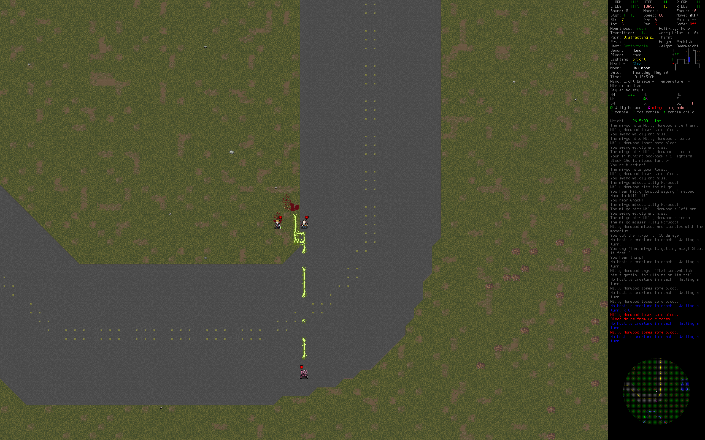

# Cataclysm: Arsenic and Old Lace

This is a fork of CDDA (https://github.com/CleverRaven/Cataclysm-DDA), where I try to use LLMs to implement organic responsiveness into Cataclysm.
This is something I would like to see in games in general, so I'm trying to create it:


Yelling (C + b) next to a follower NPC activates a local, asynchronous LLM toolcall, which thinks of an answer and some actions.
The following actions can be initiated by the toolcall right now:
- follow_player
- wait_here
- equip_gun
- equip_melee
- equip_bow
- attack=<target>

Yelling a sentence has also been changed to 'Say a sentence' with a range of around 8 tiles, depending on the weather etc.

## Files added in this fork so far

- src/llm_intent.cpp
- src/llm_intent.h
- tools/llm_runner/background_summarizer.py
- tools/llm_runner/prompt_playground.py
- tools/llm_runner/runner.py
- Generated logs (not tracked): config/llm_intent.log
- Plan.md
- build_and_run.cmd
- just_build.cmd

## Installation

There is no installer right now, so you will have to build this yourself.
Additionally, the LLMs will require you to set up a venv, download a model, and point the existing code at the right directiories.
There is an in game option section [LLM] which helps you pointing the game into the right directions.
Furthermore, depending on your hardware, small changes to the python runner may be needed, as this one is focussing on NPU use.
I paid for it so i might as well use it >:|
This means that the following setup instructions will most likely work on your machine, but if you have a nice PC you could probably do better.

There is also an option to plug in an API key, to make setup easier.
However, I am working hard to optimize this fork for local LLM use.

All following commands etc. are written for Powershell in Windows.

### Git repo cloning

First you need to do a shallow clone of this Git repo. Do this in the place you wanna install the game.

```sh
git clone --depth=1 https://github.com/josihosi/Cataclysm-AOL.git
```
In order to build this, you will need to install MYSYS2 (see [COMPILING-MSYS.md](doc/c++/COMPILING-MSYS.md)).
All the other classic ways of compiling should work too ([COMPILING.md](doc/c++/COMPILING.md)), but for MYSYS2 you can run .\build_and_run.cmd in PS to start the game.

### LLM runner (Python + OpenVINO GenAI)

This fork uses a local Python runner to generate NPC intents.
Tested on Windows with Intel Core Ultra 7 155H + NPU, using:
'OpenVINO/Mistral-7B-Instruct-v0.3-int4-cw-ov' (https://huggingface.co/OpenVINO/Mistral-7B-Instruct-v0.3-int4-cw-ov)

If you do not have an NPU, you can still use CPU or GPU (set in LLM options).
Your mileage may vary, depending on what LLM you are using.
In in-game options under [LLM], the LLM directory can be changed.

### In-game [LLM] options (Windows + Linux)
The [LLM] menu is the single place to configure the runner for both platforms.

- LLM backend: `auto`, `openvino`, or `api`.
  - `auto` tries OpenVINO first when a model dir is set, and falls back to API if configured.
  - `openvino` requires a local model dir.
  - `api` requires provider + model (and API key env var if your provider needs one).
- LLM device: `AUTO` will pick NPU -> GPU -> CPU when available.
- LLM runner venv Python path: use your venv `python.exe` on Windows, or `python3` on Linux.
- LLM model directory: only required for OpenVINO mode.

### Python packages
Create a venv and install the packages below (pinning matches the tested setup):

```sh
python -m venv C:\Users\josef\openvino_models\openvino_env
C:\Users\josef\openvino_models\openvino_env\Scripts\activate
pip install nncf==2.18.0 onnx==1.18.0 optimum-intel==1.25.2 transformers==4.51.3
pip install openvino==2025.4 openvino-tokenizers==2025.4 openvino-genai==2025.4
```

Note: This install is construed for Intel NPU use. For you, a slightly different venv may be more uh better.
If you have a GPU (you lucky bastard) you might be able to get a lot more mileage out of this than me.
If you wanna go Ollama, some functions in the python script may stop running, but then just copy paste it into a Chatbot, explain the situation, and ask for a diff.
The hard part is compatible for all LLMs, this is just a matter of changing a couple lines of code, if you wanna change the pipeline to your needs.

In in-game options under [LLM], the game can be pointed towards the venv directory.
tools/llm_runner/prompt_playground.py can be used for debugging your LLM pipeline, if you changed the venv etc.

### Runner self-test
You can sanity-check the runner from your venv before launching the game.

OpenVINO (local):
```sh
# Windows
C:\Users\josef\openvino_models\openvino_env\Scripts\python.exe tools\llm_runner\runner.py --self-test --backend openvino --model-dir "C:\path\to\ov_model" --device AUTO

# Linux
python3 tools/llm_runner/runner.py --self-test --backend openvino --model-dir "/path/to/ov_model" --device AUTO
```

API (will use your provider, may cost money):
```sh
# Windows or Linux
python tools\llm_runner\runner.py --self-test --backend api --api-provider "OpenAI" --api-model "gpt-4.1" --api-key-env "CATACLYSM_API_KEY"
```

### API call alternative
Disclaimer: I am fully committed to optimizing this fork for local LLMs. 
However, to make trying this fork out easier, I added in an option to use API calls instead.

Save your API key as global variable:

```sh
setx CATACLYSM_API_KEY "your_key"

Install any-llm with the povider(s) you want:
<your_venv>\Scripts\python.exe -m pip install "any-llm-sdk[provider,provider or l]"
```

In-game, set the Python path option under Options -> [LLM] -> "LLM runner Pythonpath" to point at that venv's `python.exe`.

Admittedly, API calls will give you faster and better responses on most machines. On mine for sure.
That's why I would like to fine tune a model for this.

### Runner usage
The LLM call is initiated by shouting (C + b) in-game next to an NPC that is following you.
It collects a game snapshot and sends it to the LLM, together with your utterance.
The LLM is supposed to create an answer, as well as 1-3 actions.
Since LLMs are slow (for me compute time is 10-20s atm) the runner is async and does not block normal NPC AI.
It calculates and injects a message and actions on the first possible turn.
Therefore, any used model has to balance intelligence and speed.

Heres an example snapshot:

```sh
prompt Willy Norwood (req_0)
Situation:
SITUATION
id: req_0
player_name: Alyson Shackelford
player_utterance: Watch out for that soldier zombie!

your_name: Willy Norwood
your_background: codger
your_tone: Rambling, Dramatic, Folksy, Eccentric, Jester
your_example_expression: "A gorram moose! Livin' in the ol' ranger station!"
your_state[0-10]: morale=5 hunger=0 thirst=0 pain=0 stamina=10 sleepiness=0 hp_percent=10 effects=[socialized_recently:1 asked_to_socialize:1]
your_emotions[0-10]: danger_assessment=0 panic=0 confidence=10
your_personality[0-10]: aggression=7 bravery=8 collector=5 altruism=8
your_opinion_of_player[0-10]: trust=6 intimidation=5 respect=6 anger=5

threats: zombie soldier threat_score[0-100]=12
friendlies: player

inventory: wielded="Army bayonet"
inventory_usable: [Army bayonet, smartphone (UPS) (unbrowsed), |\ hairpin]
inventory_combat: [++ 5-round hunting shotgun+1 (5/5), Army bayonet, ++ yellow hard hat]
bandage_possible: false

legend:
- ... open area
0 ... obstructive area (movement speed > 100)
6 ... obstructed area
[a - z] ... creature
[A - Z] ... obstructed creature
| ... You (NPC)
map_legend:
b ... zombie soldier
a ... player
map:
0--00--00--00--00--00--------------------
---00--00--00--0---00--------------------
-----------------------------------------
-6666666---------------------------------
-60000----0------------------------------
-6-------00------------------------------
-600-0---00------------------------------
-6666666---------------------------------
-----------------------------------------
-----------------------------------------
-----------------------------------------
-----------------------------------------
-----------------------------------------
-----------------------------------------
-----------------------------------------
-----------------------------------------
-----------------------------------------
-----------------------------------------
-----------------------------------------
-----------------------------------------
--------------------|--------------------
-------------------b---------------------
-----------------------------------------
-----------------------------------------
--------------------a--------------------
-----------------------------------------
-----------------------------------------
-----------------------------------------
-----------------------------------------
-----------------------------------------
-----------------------------------------
-----------------------------------------
-----------------------------------------
-----------------------------------------
-----------------------------------------
-----------------------------------------
-----------------------------------------
-----------------------------------------
-----------------------------------------
-----------------------------------------
-----------------------------------------

<System>You are controlling a human survivor NPC in a cataclysmic world, exhausted, armed, and trying not to die.Return a single line only, with correct syntax, to be parsed by the game.This line has two to four fields separated by ‘|’ :
<Field 1>The first field is an answer to player_utterance.You have decided to team up with the player for now, and must answer as the NPC.Stick to your role, with your emotions and opinions.Use a dry tone, with swear words, fit for a zombie apocalypse.</Field 1>
<Fields 2-4>Write 1-3 of the following allowed actions:wait_here, follow_player, equip_gun, equip_melee, equip_bow, idle, attack=<target>
<Allowed actions>wait_here to stay put, keep watch, wait, stand.
follow_player to walk behind, follow, run.
equip_gun to equip gun, rifle, thrower, get ready to shoot.
equip_melee to equip melee, get ready to bash, cut, kick, stab.
equip_bow to use bow, crossbow, stealth.
attack=<target> to attack a target from your map.
idle if none of the above.
</Allowed actions>
</Fields 2-4>
Print only Fields 1-4, separated by | .If you break this format, you have failed.Output a single line with an answer and actions from the allowed list, in fields separated by ‘|’ and no additional text.
<Example Output 1>Blow me.|idle</Example Output 1>
<Example Output 2>Lets put those fucks in the ground.|equip_melee|attack=zombie</Example Output 2>
<Example Output 3>Providing cover!|wait_here|equip_gun</Example Output 3>
<Example Output 4>Lets get some dinner!|equip_gun|attack=chicken</Example Output 4>
<Example Output 5>Don't worry, I'm ready to kick some teeth in.|equip_melee</Example Output 5>
<Example Output 6>Locked and loaded.|equip_gun</Example Output 6>
</System>


say Willy Norwood (req_0)
Ain't my first deadhead rodeo, Alyson—let's show that sack of rot who's boss!

response Willy Norwood (req_0)
{"request_id": "req_0", "ok": true, "text": "Ain't my first deadhead rodeo, Alyson\u2014let's show that sack of rot who's boss!|equip_gun|follow_player|attack=zombie soldier", "metrics": {"gen_time_ms": 2278.3687000046484, "max_new_tokens": 20000}}
```
## Compile
This section is from the original CDDA repo, as it applies to this fork as well.

Please read [COMPILING.md](doc/c++/COMPILING.md) - it covers general information and more specific recipes for Linux, OS X, Windows and BSD. See [COMPILER_SUPPORT.md](doc/c++/COMPILER_SUPPORT.md) for details on which compilers we support. And you can always dig for more information in [doc/](https://github.com/CleverRaven/Cataclysm-DDA/tree/master/doc).

We also have the following build guides:
* Building on Windows with `MSYS2` at [COMPILING-MSYS.md](doc/c++/COMPILING-MSYS.md)
- For MSYS2 building, you may use 'build_and_run.cmd --unclean'
* Building on Windows with `vcpkg` at [COMPILING-VS-VCPKG.md](doc/c++/COMPILING-VS-VCPKG.md)
* Building with `cmake` at [COMPILING-CMAKE.md](doc/c++/COMPILING-CMAKE.md)  (*unofficial guide*)

# Contribute

Thank you so much to all the contributors to CDDA!
https://github.com/CleverRaven/Cataclysm-DDA

If you want to contribute, and are comfortable to sharing a bit of private information, you can easily!
When playing the fork, enable LLM logging in the [LLM] menu and send me /config/llm_intent.log, after you've tried it out.
I can use the snapshots to train/distill an LLM, to make it snappy and more accurate.
Needs at least 5k snapshots, apparently.
So, send it to innovation@dabubu.at, or don't :)

Alternatively, if you want to request additional LLM functions, just contact me somehow.

Also, this entire fork was vibe-coded using Codex CLI. Thanks to the folks at OpenAI.

If I forgot to thank somebody, please just tell me.

#### Is there a tutorial?

Yes, you can find the tutorial in the **Special** menu at the main menu (be aware that due to many code changes the tutorial may not function). You can also access documentation in-game via the `?` key.

#### How can I change the key bindings?

Press the `?` key, followed by the `1` key to see the full list of key commands. Press the `+` key to add a key binding, select which action with the corresponding letter key `a-w`, and then the key you wish to assign to that action.

#### How can I start a new world?

**World** on the main menu will generate a fresh world for you. Select **Create World**.

## To-do (if the ADHD gods allow it)

- More LLM actions
- LLM training
- NPC backstory snapshot inclusion
- NPC conversation overhaul?
