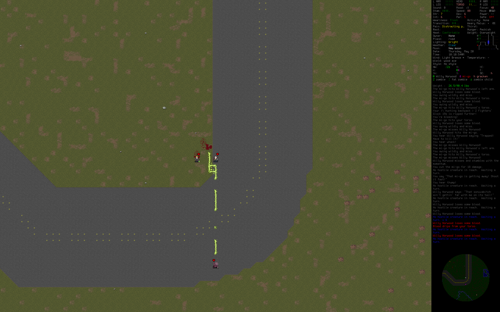

# Cataclysm: Arsenic and Old Lace

Cataclysm: Arsenic and Old Lace (C-AOL) is a fork of [Cataclysm: Dark Days Ahead](https://github.com/CleverRaven/Cataclysm-DDA) and [Cataclysm-TLG](https://github.com/Cataclysm-TLG/Cataclysm-TLG) that adds an LLM-driven NPC intent runner. The goal is simple: let NPCs answer you in free text, react with more personality, and take a small set of meaningful actions without turning the whole game into a chatbot tech demo.

Huge thanks to the CDDA and CTLG maintainers and contributors. They built the game this fork stands on.



[Video](https://youtu.be/HfishtPzvhA), so you know the repo is real.

## What this fork already does

- Lets you talk to follower NPCs in free text.
- Sends an NPC-centric snapshot to a local or API-backed runner.
- Turns the model output into in-game speech plus up to three action tokens.
- Supports follower actions such as `follow_close`, `follow_far`, `wait_here`, `hold_position`, `equip_gun`, `equip_melee`, `equip_bow`, `look_around`, `look_inventory`, `panic_on`, `panic_off`, `attack=<target>`, and short directional move chains.
- Supports optional random/spontaneous NPC calls.
- Lets ambient NPCs answer too, even when they are not the directly commanded follower.

## Releases first

If you just want to **play the fork**, start with the GitHub releases instead of cloning the repo:

<https://github.com/josihosi/Cataclysm-AOL/releases>

Release artifacts are built for the port branches:

- **`port/cdda-master`** — AOL on current CDDA master
- **`port/cdda-0.I`** — AOL on CDDA 0.I
- **`port/cdda-0.H`** — AOL on CDDA 0.H
- **`port/ctlg-master`** — AOL on CTLG master

Formats:
- **Windows** → `.zip`
- **Linux** → `.tar.gz`
- **macOS** → `.dmg`

Pick the release that matches the upstream line you actually want to play. Do not mix expectations or saves across branches just because they all have AOL features on top.

## Source branches

If you are building from source or contributing, the branch roles are:

- **`master`** — main source branch
- **`dev`** — ongoing development branch
- **`port/*`** — compatibility/release branches for specific upstream targets

If you only want the latest normal source state, start from `master`. If you want the specific release-target branches, use the matching `port/*` branch.

## LLM runner overview

The game talks to `tools/llm_runner/runner.py`. You configure it in the in-game **[LLM]** options menu.

The important options are:

- **Enable LLM intent runner**
- **LLM backend** (`ollama`, `api`, or `openvino`)
- **OpenVINO venv path** — despite the name, this is effectively the Python path the game uses to launch `runner.py`
- **Ollama URL / model**
- **API key env var / API model**
- **OpenVINO model path / device**

Current backend choices:

- **Ollama** — recommended local path for most people
- **API via any-llm** — easiest way to get good responses quickly
- **OpenVINO** — advanced local path, especially relevant for Intel/NPU setups

Important: even for **API** or **Ollama**, the game still needs a valid Python executable/venv path so it can launch `tools/llm_runner/runner.py`. In the options menu that field is currently labeled **OpenVINO venv path**, which is a bit misleading but still the right place to point at your Python.

## Installation / setup

### 1. Easiest path: play a release

1. Download a release from the page above.
2. Unpack it.
3. Start the game once.
4. Open the in-game **[LLM]** options.
5. Pick a backend and fill in the matching settings.

That is the normal path. Cloning the repo is only for source builds or development.

### 2. Choose an LLM backend

#### Option A — API via any-llm (easiest overall)

This is the quickest way to get the fork working if you already have an API key.

Example setup in a Python venv:

```powershell
python -m venv .venv
.\.venv\Scripts\activate
pip install "any-llm-sdk[openai]"
setx CATA_API_KEY "your_key_here"
```

Then set these in the in-game **[LLM]** menu:

- **LLM backend** → `api`
- **OpenVINO venv path** → your Python executable or the venv you installed `any-llm` into
- **API key env var** → `CATA_API_KEY`
- **API model name** → e.g. `gpt-4.1-mini`

Notes:
- `CATA_API_KEY` is the default env-var name used by the game options.
- `any-llm` supports multiple providers. If you are not using OpenAI, install the matching extra and set the provider/model accordingly.

#### Option B — Ollama (recommended local path)

If you want a local setup without the OpenVINO-specific baggage, Ollama is the easiest local backend.

1. Install Ollama.
2. Pull a model you actually want to run.
3. Point the game at that model in the **[LLM]** menu.

Example:

```powershell
ollama pull mistral
```

Then set these in the game:

- **LLM backend** → `ollama`
- **OpenVINO venv path** → a normal Python 3 executable or venv
- **Ollama URL** → usually `http://127.0.0.1:11434`
- **Ollama model name** → e.g. `mistral`

A normal Python 3 install is enough for the runner here; you do not need the OpenVINO stack just to use Ollama.

#### Option C — OpenVINO (advanced local path)

This path is mainly for local Intel/OpenVINO setups and is the most fiddly one.

Example venv install matching the tested setup:

```powershell
python -m venv C:\path\to\openvino_env
C:\path\to\openvino_env\Scripts\activate
pip install nncf==2.18.0 onnx==1.18.0 optimum-intel==1.25.2 transformers==4.51.3
pip install openvino==2025.4 openvino-tokenizers==2025.4 openvino-genai==2025.4
```

Then set these in the game:

- **LLM backend** → `openvino`
- **OpenVINO venv path** → path to the venv or directly to the Python executable
- **OpenVINO model path** → path to the local model directory
- **OpenVINO device** → usually `AUTO`, unless you know you want `CPU`, `GPU`, or `NPU`

This fork was heavily tested on an Intel Core Ultra machine, but OpenVINO is not the only supported path anymore.

### 3. Runner self-test

You can sanity-check the runner before launching the game.

#### API

```powershell
python tools\llm_runner\runner.py --self-test --backend api --api-provider openai --api-model gpt-4.1-mini --api-key-env CATA_API_KEY
```

#### Ollama

```powershell
python tools\llm_runner\runner.py --self-test --backend ollama --ollama-url http://127.0.0.1:11434 --ollama-model mistral
```

#### OpenVINO

```powershell
python tools\llm_runner\runner.py --self-test --backend openvino --model-dir "C:\path\to\ov_model" --device AUTO
```

If the self-test works but the game does not, the next thing to check is usually the in-game **[LLM]** option values rather than the runner itself.

## Building from source

Only do this if you want the source tree, want to build the game yourself, or want to work on the fork.

### Clone the repo

```powershell
git clone https://github.com/josihosi/Cataclysm-AOL.git
cd Cataclysm-AOL
```

If you want a specific branch:

```powershell
git checkout master
# or: git checkout dev
# or: git checkout port/cdda-master
```

### Build shortcuts in this repo

The repo includes some convenience scripts:

- **Windows build+run** → `build_and_run.cmd`
- **Windows build only** → `just_build.cmd`
- **Linux build+run** → `build_and_run_linux.cmd`
- **Linux build only** → `just_build_linux.cmd`
- **macOS build+run** → `build_and_run_macos.sh`
- **macOS build only** → `just_build_macos.sh`

Examples:

```powershell
.\build_and_run.cmd --unclean
.\just_build.cmd --unclean
```

```bash
./build_and_run_macos.sh --unclean
./just_build_macos.sh --unclean
```

For fuller platform docs, still read the upstream compile docs too:

- [COMPILING.md](doc/c++/COMPILING.md)
- [COMPILING-MSYS.md](doc/c++/COMPILING-MSYS.md)
- [COMPILING-VS-VCPKG.md](doc/c++/COMPILING-VS-VCPKG.md)
- [COMPILER_SUPPORT.md](doc/c++/COMPILER_SUPPORT.md)

## Background summaries

NPC background summaries are short generated text files that get injected into the snapshot so the model has a compact sense of who that NPC is supposed to be. The build-time helper for this is `tools/llm_runner/background_summarizer.py`, which writes the generated files into `data/json/npcs/Backgrounds/Summaries_short`.

This also ties neatly into modding: you can ship your own summaries with content, and the game can also load extra selector-based overrides from `data/json/npcs/Backgrounds/Summaries_extra`. So the summary system is not just flavor text for the base fork; it is also a small extension point for NPC personality modding.

If you want to generate summaries during build scripts, some helpers support `--with-summary`. The macOS helper also lets you choose whether summary generation uses `ollama` or `openvino`.

## Snapshot example

The runner gets a compact NPC-centric prompt snapshot plus your utterance, then returns a single-line response with speech and actions.

<details>
<summary>Example snapshot / response</summary>

```sh
prompt Willy Norwood (req_2)
Situation:
SITUATION
id: req_2
player_name: Alyson Shackelford
player_utterance: Pick up that axe, fast, and lets book it!

your_name: Willy Norwood
your_background: codger
your_tone: Rambling, Dramatic, Folksy, Eccentric, Jester
your_example_expression: "A gorram moose! Livin' in the ol' ranger station!"
your_state[0-10]: morale=6 hunger=0 thirst=0 pain=8 stamina=10 sleepiness=0 hp_percent=7 effects=[bite:1 bandaged:4 bandaged:4 socialized_recently:1 asked_to_socialize:1]
your_emotions[0-10]: danger_assessment=0 panic=0 confidence=6
your_personality[0-10]: aggression=7 bravery=8 collector=5 altruism=8
your_opinion_of_player[0-10]: trust=6 intimidation=5 respect=6 anger=5

threats: (none)
friendlies: player

inventory: wielded="wood axe"
weapons: [Fighters' Glock 19 (17/17), Fighters' Glock 19 (17/17), wood axe]
bandage_possible: true

legend:
- ... open area
0 ... obstructive area (movement speed > 100)
6 ... obstructed area
[a - z] ... creature
[A - Z] ... obstructed creature
| ... You (NPC)
map_legend:
b ... American crow
a ... player
c ... American crow
map:
-------------------------------------0--0
----------------------------------00----0
-----0--------------------------------0--
------------------------------------0----
--------------------------------------0--
----------------------------------------0
----------------------------------------0
-----------------------------------------
-----------------------------------------
-----------------------------------------
-----------------------------------------
-----------------------------------------
-----------------------------------------
-----------------------------------------
-----------------------------------------
-----------------------------------------
-----------------------------------------
-----------------------------------------
---b-------------------------------------
--------------------a--------------------
--------------------|--------------------
-----------------------------------------
-----------------------------------------
-----------------------------------------
-----------------------------------------
-----------------------------------------
-----------------------------------------
-----------------------------------------
c----------------------------------------
-----------------------------------------
-----------------------------------------
-----------------------------------------
-----------------------------------------
-----------------------------------------
-----------------------------------------
-----------------------------------------
-----------------------------------------
-----------------------------------------
-----------------------------------------
-----------------------------------------
-----------------------------------------

response Willy Norwood (req_2)
{"request_id": "req_2", "ok": true, "text": "Ain’t gonna argue, sugar—my leg’s half-ripped but I can still hoof it. Let’s light a fire under our asses!|follow_close|equip_melee", "metrics": {"gen_time_ms": 2357.415599981323, "max_new_tokens": 20000, "use_api": true}}
```

</details>

## Contributing

If you want to contribute, bug reports and real play logs are useful.

When playing the fork, you can enable LLM logging in the **[LLM]** menu and send `config/llm_intent.log`. Those logs contain the snapshots and runner results that help tune prompts, action handling, and future model work.

You can also request new LLM actions or report behavior that is flaky, unclear, or silently failing. Those are often the most valuable bugs because they usually point at weak NPC action contracts rather than just bad model phrasing.

Thanks as well to the people behind [Codex CLI](https://developers.openai.com/codex/cli) and [OpenClaw](https://github.com/openclaw/openclaw), both of which were used heavily while building this fork.

## FAQ

### Is there a tutorial?

Yes. You can find the tutorial in the **Special** menu at the main menu, though it may lag behind the fork.

### How can I change the key bindings?

Press `?`, then `1`, to see the command list. Press `+` to add a key binding.

### How can I start a new world?

Choose **World** on the main menu, then **Create World**.
