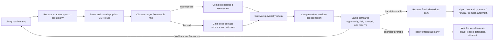
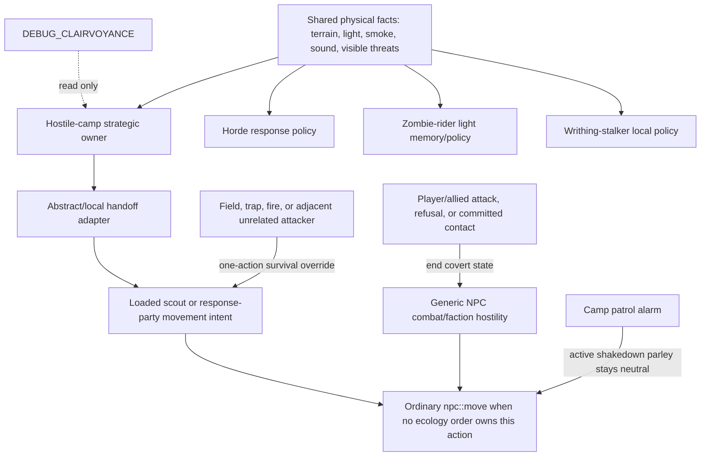

# Bandit and Cannibal Hostile-Camp AI Specification

Status: normative design contract and implementation audit for the isolated Mac `dev` lane.
Comparison baseline: `port/cdda-master` at `660057ff728b` versus `dev` at `1844bc8324a3`.

This document defines what the feature must do in play, how the implementation is divided between
game systems, and which parts of the current `dev` diff are complete, partial, or absent. It is not
a second task roadmap: `Plan.md` and `SUCCESS.md` still determine execution order.

## Document authority and supersession

- `Plan.md` is the sole roadmap, this file is the normative functional/technical contract,
  `SUCCESS.md` is the outcome ledger, `TODO.md` is only the next execution claim, and `TESTING.md`
  owns current proof policy/evidence.
- Older dated bandit/cannibal packet, audit, and proof documents are implementation archaeology.
  They may explain why a seam exists, but they cannot add requirements, declare success, or
  override this contract and current source evidence.
- `TechnicalTome.md` is chronological mechanic history, not a second current-state specification.
  If its historical wording conflicts with this file, this file and the inspected game path win.
- Do not recreate a phase ledger or parallel roadmap. Close work by crossing the matching red item
  here and the corresponding outcome in `SUCCESS.md`, then reduce `TODO.md` to the next necessary
  claim.

Status markers:

- `[x]` is present in the game path and has proportionate source/test evidence.
- `[ ] 🔴` is wrong, incomplete, or unproved. When closed, replace it with `[x]` and add the proof.
- A unit-tested state structure is not considered implemented if no production game path invokes it.

## Functional contract

A naturally generated bandit or cannibal camp is a persistent physical faction. It sends a
two-person scout party to explore and scavenge, learns only what the scouts can plausibly perceive,
withdraws coherently when discovered, receives only information carried home by survivors, and
decides whether it has enough strength and opportunity to act. A favorable bandit decision creates
a new shakedown party. A favorable cannibal decision creates a new attack party which waits for
true darkness. Neither faction knows the avatar's coordinates or camp contents by fiat.

The player-facing success path is:

## Required behavior and current implementation

### 1. Camp, roster, and dispatch ownership

- [x] Bandit and cannibal camps use the same routine exploration machinery. Cannibals do not need
  a separate supernatural hunt trigger.
- [x] Routine scouts are exactly two people. A one-person camp cannot dispatch; a two-person camp
  sends both; larger camps send two while retaining an at-home reserve where their roster permits.
  The number two is the agreed product rule, not a tuning guess.
- [x] The camp owns one serialized roster whose members are unambiguously at home, reserved,
  outbound, materialized, returning, dead, missing, or retired. A member cannot be simultaneously
  available to camp jobs and an outing.
- [x] Routine scouting, returned assessment, and hostile response are different operations with
  stable IDs, generations, reservation members, and idempotent application keys. A scout mission
  does not silently turn into a raid.
- [x] A camp has at most one active external operation. A response cannot reserve members while a
  scout or another response still owns outside pressure for that camp.
- [x] A deterministic surviving member replaces a dead leader; the pair retains its shared route
  and operation identity.

### 2. World truth, private knowledge, and bounty

- [x] Finite structural/ground bounty is global world truth. Each camp stores only its private,
  possibly stale estimate. Two camps may believe a site is rich, but only the first valid claimant
  consumes its remaining resource.
- [x] Bandit and cannibal scouts both search for and collect finite bounty as part of routine
  scouting.
- [x] Camp leads carry provenance, observation time, confidence/uncertainty, threat, bounty,
  approximate position, and aging. Active operations pin referenced evidence so ordinary pruning
  cannot invalidate a live mission.
- [ ] 🔴 Player-camp opportunity is not yet a renewable authoritative value. Repeated shakedowns
  must require both the existing cooldown and genuinely renewed camp value from stored goods,
  population, or activity. A timer alone must not regenerate loot or authorize repeated demands.

### 3. Perception and discovery

- [x] The production branch's exact-avatar radar (`direct_player_range`, ten OMTs) is absent from
  the active `dev` path. The remaining `legacy_radar` value is compatibility vocabulary for old
  saves, not a live sensor.
- [x] Scouts acquire facts only from a bounded route/frontier query. The ordinary baseline is
  roughly three OMTs in clear day, two in degraded light/dusk, and one in unlit night, with terrain,
  weather, elevation, optics, and the actual NPC's sight affecting the result. These numbers are
  the agreed visibility rule.
- [x] Optics improve credible observation and assessment; they do not grant arbitrary map-wide
  player or camp tracking.
- [x] Smoke, visible light, searchlights, alarms, gunfire, and explosions create approximate leads.
  A signal may cause investigation, but it does not reveal the avatar's identity, exact inventory,
  or current coordinates.
- [x] Terrain supplies a prior danger cost. Live hostile population is sampled only where a scout
  can legitimately observe it; the camp does not query unseen zombie populations as omniscient
  route data.
- [x] Danger has soft and hard effects: risk can increase route cost, while an observed overwhelming
  threat can reroute, abort, or force immediate self-defense.

### 4. Physical movement, stalking, and exposure

- [x] The strategic operation has one simulation owner at a time: abstract overmap or local loaded
  NPCs. Handoff epoch and generation checks reject stale or duplicate advancement.
- [x] A scout pair has a leader, escort, common route, assigned staging tiles, cohesion rules,
  regroup behavior, bounded recovery, and casualty-aware continuation.
- [x] The target camp footprint and a watch position remain distinct. Normal stalking observes from
  a three-OMT radius—two empty OMTs between the scouts and the camp—and falls farther back when
  terrain or exposure requires it.
- [x] Reciprocal ordinary visual contact burns the party. Being burned adds useful close-contact
  evidence and target alertness, then commits the scouts to egress. It is not deliberately farmed
  as a scouting tactic.
- [x] While searching, watching, or withdrawing covertly, scouts are neutral to the player and
  allied defenders. Generic faction hostility and misleading “gets angry” presentation resume only
  after attack, refusal/escalation, or committed combat.
- [x] A burned party has a persistent route out of the target OMT. It is not constrained to pace
  between adjacent visible tiles while its strategic owner wants to leave.
- [ ] 🔴 The natural local-to-abstract return handoff is not complete. Run `20260807_152913` proves
  exact two-member staging, forward travel, watch completion, and a later valid `returning_home`
  handoff, but the pair still fails to cross a homeward bubble boundary and dematerialize at camp.
  This is the current first gameplay blocker.

### 5. Report, assessment, and response decision

- [x] A camp learns no useful target dossier until a survivor physically returns. Two dead scouts
  yield only overdue/missing state. One survivor yields a partial/provisional report restricted to
  evidence available to that survivor; a later survivor may revise it.
- [x] Reports identify their source operation, member(s), evidence revisions, timestamps, target,
  uncertainty, defender bounds, coarse visible equipment, opportunity cues, route risk, exposure,
  and losses. Applying the same return/report/cargo packet twice is a no-op.
- [x] Camp assessment compares pessimistic target strength, uncertainty, alertness, route risk,
  opportunity, ready camp power, and the required home reserve. It may hold, rescout, abandon, or
  prepare one faction-specific follow-on.
- [x] A follow-on response selects and reserves a fresh party from current survivors rather than
  reusing the scout reservation. The current planner preserves the report revision and operation
  generation.
- [ ] 🔴 The production scheduler never calls `plan_hostile_operation`; current calls are confined
  to tests. `transition_hostile_operation_phase` is likewise exercised by tests and origin-recall
  cleanup, not by a complete live response lifecycle. The follow-on owner is therefore scaffolding,
  not an implemented player-facing feature.

### 6. Faction-specific consequences

Bandits and cannibals share exploration and assessment. They diverge only after a returned report
authorizes a response.

- [ ] 🔴 **Bandit shakedown:** reserve a fresh response party, travel physically, rally outside the
  camp at a plausible two-to-three-OMT planning distance, approach openly, suppress premature
  patrol combat, demand a share of currently reachable camp storage, and resolve payment, refusal,
  player attack, withdrawal, casualties, and return.
  The parley-neutrality hook exists, but no natural scout-to-shakedown run proves the lifecycle.
- [ ] 🔴 **Cannibal raid:** reserve a fresh attack party sized against pessimistic camp strength,
  travel physically, rally in concealment at a plausible two-to-three-OMT planning distance, wait
  for true local darkness, and attack the avatar plus all loaded camp defenders. Cannibals never
  open the payment interface. No invisible offscreen defender deaths are permitted. The state
  vocabulary exists, but the live lifecycle is not wired or proved.
- [ ] 🔴 Aftermath must update the attacking camp's casualties, readiness, target alertness,
  outcome memory, payment/plunder, and future eligibility. A bandit may repeat only after cooldown
  plus renewed target opportunity; a cannibal may reassess survivors rather than replaying an
  obsolete report.
- [x] Autonomous inter-camp war is outside this version. Other hostile camps contribute route risk;
  they do not trigger a second unspecced faction-war simulation.

### 7. Persistence, performance, and proof

- [x] Camps, private leads, finite resources, outings, reservations, reports, decisions, casualties,
  ownership epochs, and application watermarks have serialization and focused compatibility tests.
- [x] `DEBUG_CLAIRVOYANCE` provides a read-only ecology view, selection, bounded watches, compact
  deltas, incident capture, and one labelled casualty intervention through the authoritative death
  route. The observer is not a gameplay owner.
- [ ] 🔴 Save/load at each live lifecycle boundary—including local/abstract handoff, split return,
  shakedown contact, and cannibal darkness wait—must be proved with the changed executable.
- [ ] 🔴 Mac performance/save measurements for the observer and early ecology are not final
  qualification for the completed feature. Before integration, measure the full production path
  on macOS, Linux/WSL, and Windows, including scheduler cost, loaded-NPC cost, save-size growth, and
  save/load latency. Do not run global work every avatar turn merely to satisfy a test.
- [ ] 🔴 Release qualification remains blocked until the natural scout-to-decision incident,
  bandit shakedown, cannibal night raid, persistence boundaries, and relevant platform routes are
  green. `port/cdda-master` remains untouched meanwhile.

## Competing AI systems and override direction

The feature does not replace CDDA NPC AI. It supplies a strategic owner and a narrow movement
intent while an ecology operation is active. Existing survival and combat owners keep precedence
where their facts are more immediate.

### Ownership and precedence table

| Situation | Authoritative owner | Override rule |
|---|---|---|
| Camp memory, dispatch eligibility, report, decision, reservation | `bandit_live_world` strategic state | No generic NPC behavior may create or advance these facts. |
| Unloaded travel/search/watch/return | Abstract outing cursor | Only the matching operation generation and owner epoch advances. |
| Materialization/dematerialization | `do_turn.cpp` handoff adapter plus overmap NPC storage | Transfer ownership atomically; never let local and abstract loops move the same member. |
| Loaded route/cohesion/egress | Ecology movement intent for the exact reserved members | Own only the next action needed by the persisted operation; fall through when no valid order exists. |
| Fire, field, trap, impassable tile, adjacent unrelated threat | Existing immediate-survival/combat behavior | May preempt one action without deleting the strategic route or inventing a phase transition. |
| Player/allied attack, bandit refusal, committed raid/contact | Existing NPC combat and faction attitude | Explicitly terminates covert neutrality; combat becomes authoritative until contact resolves. |
| Generic faction hostility during covert stalking | Derived covert relationship in `npc::attitude_to` | Suppress hostility only for active, correctly targeted ecology members; never persist a fake faction change. |
| Player-camp patrol during bandit parley | Camp patrol AI | Treat only the active shakedown party as neutral until escalation. Other hostiles remain hostiles. |
| Ordinary inactive NPC travel | Existing `overmap_npc_move` / NPC `omt_path` | Must yield for members owned by an active ecology operation to prevent double travel. |
| Ordinary loaded NPC needs, missions, behavior tree, and optional LLM intent | Existing `npc::move` path | The exact reserved member's valid ecology order owns that action first; ordinary AI resumes when no ecology order applies or covert state ends. LLM output never creates strategic ecology truth. |
| Debug UI/harness | Read-only observer and labelled authoritative casualty intervention | May reveal state or kill a selected member through the real death route; may not set discovery, phase, report, decision, payment, or raid outcome. |

`bandit_dry_run` and `bandit_pursuit_handoff` are also potential duplicate owners inside the
feature. Their permitted roles are deliberately narrow: `bandit_dry_run` may evaluate or explain a
candidate, and `bandit_pursuit_handoff` may validate/transport a transition packet. Neither owns a
second camp memory, reservation, lifecycle clock, or result. Persisted truth remains in
`bandit_live_world` and the normal NPC/overmap stores.

### Shared primitives versus separate policies

Hordes, zombie riders, writhing stalkers, bandits, and cannibals may consume the same physical
emitter primitives. They must not share behavioral memory or ownership merely because they noticed
the same event.

| Primitive or state | Bandit/cannibal camps | Hordes | Zombie riders | Writhing stalkers |
|---|---|---|---|---|
| Physical light/smoke/sound observation | Shared input | Shared input | Shared input | Shared input where its local/overmap contract permits |
| Terrain and ordinary visibility | Shared engine primitive | Own policy | Own policy | Own policy |
| Camp intelligence map / dossiers | Own, private per camp | Never | Never | Never |
| Finite bounty and shakedown value | Own hostile-camp system | Never | Never | Never |
| Scout/report/response reservations | Own hostile-camp system | Never | Never | Never |
| Movement and reality-bubble handoff | Exact camp-operation members only | Existing horde owner | Rider owner | Stalker owner |
| Debug projection | May share observer presentation | May be displayed | May be displayed | May be displayed |

Direction: introduce or retain a small read-only **physical observation** interface at the producer
boundary, then let each consumer decide what it means. Do not introduce a universal “ecology AI”
brain, universal target registry, shared pursuit memory, or generic phase setter. For any actor that
could be claimed by two movement systems, the deciding key is the actor's stable identity plus the
active owner's generation/epoch; the loser yields without mutating the winner's state.

## Conformance summary: `dev` versus `port/cdda-master`

What is right in `dev`:

- [x] It removes the production branch's ten-OMT avatar radar and replaces it with bounded,
  provenance-bearing perception.
- [x] It creates persistent private camp knowledge, global finite-resource truth, two-person
  scouting, stable reservations, abstract/local ownership, cohesive movement, exposure egress,
  survivor-scoped reports, camp assessment, and honest observer tooling.
- [x] It separates a returned scouting operation from a fresh hostile response operation and keeps
  bandit/cannibal consequences distinct at the policy level.
- [x] It adds derived covert neutrality instead of permanently editing faction relations, and it
  gives camp patrols a narrow shakedown-parley exception.

What is incomplete or currently wrong:

- [ ] 🔴 The local/abstract ownership seam still strands a real returning pair before camp
  dematerialization.
- [ ] 🔴 The fresh hostile-operation planner and phase machine are not invoked by the production
  scheduler, so bandit and cannibal consequences remain test-only scaffolding.
- [ ] 🔴 Renewable player-camp opportunity and complete aftermath/repeat rules are absent.
- [ ] 🔴 Full live save/load, performance/save-growth, and three-platform qualification remain
  open and must follow the completed gameplay path rather than isolated helper success.

## Acceptance ledger

The feature is complete when these user-visible contracts are crossed off with changed-executable
evidence. Existing focused tests may support a row but cannot replace its stated live route.

- [ ] 🔴 One natural bandit camp dispatches its exact pair, watches or burns, physically returns at
  least one survivor, applies a final report, and enters the matching camp decision without a
  teleported or abstract-jump return.
- [ ] 🔴 A burned visible pair gains evidence, exits the target OMT without dancing or false anger,
  and preserves its route/report identities.
- [ ] 🔴 Killing both scouts prevents an informed response; one survivor produces only a partial
  report; a later survivor revises rather than duplicates it.
- [ ] 🔴 A decided bandit response reserves a fresh party, reaches the camp, performs a real
  shakedown, and resolves payment, refusal/combat, return, and aftermath.
- [ ] 🔴 A decided cannibal response reserves a fresh party, waits for true darkness, attacks all
  loaded defenders without a payment UI, and causes no offscreen defender deaths.
- [ ] 🔴 Two camps cannot double-harvest one finite site; a repeated bandit shakedown requires
  cooldown plus demonstrably renewed player-camp opportunity.
- [ ] 🔴 Quiet play inside the old radar radius remains undiscovered; clear day/dusk/unlit night,
  forest/weather/optics, decoy signals, target relocation, and zombie-heavy route cases follow the
  bounded perception contract.
- [ ] 🔴 Save/load preserves authority and causality at every phase; full-feature performance and
  save growth remain acceptable on macOS, Linux/WSL, and Windows.
