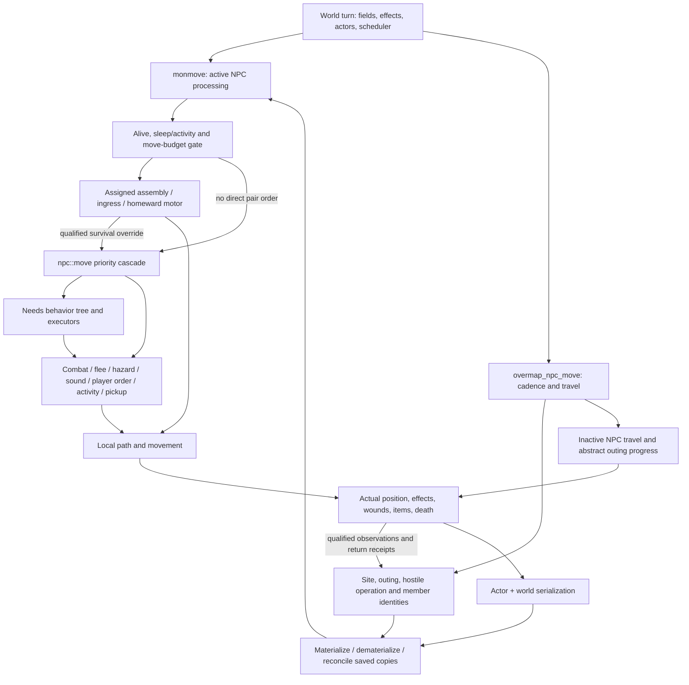

# NPC AI: who controls what

Source review, 2026-10-02. This is a navigation and diagnosis map of the current **working tree**, not an alternative gameplay specification or a claim that every interaction is tested. The source hashes and test-name index are in `.de67/task-logs/npc-ai-review-20261002/inventory.json`. Re-find symbols after source changes; line numbers below are landmarks.

Start here, then read [handover and encounter tests](npc-ai-interaction-tests.md). Existing FS requirements and accepted evidence retain their authority. In particular, do not rerun completed setup, erase interrupted runs, or diagnose a bug from an absent action row alone.

## What the code actually contains

There is no single NPC state machine. `mission`, player-facing `attitude`, an activity, a needs commitment, local and overmap destinations, group membership, and simulation ownership are different pieces of state. Several can coexist. The first diagnostic question is **which caller selected this actor's action this turn?** A group order is not evidence that the ordinary NPC decision function ran.

The arrows summarize callers, not a proposed rewrite. Not every local action passes through `npc::move`; not every inactive actor belongs to an abstract outing. Companion missions are another representation and are deliberately excluded from ordinary local loading.

## Primitive inventory

| Surface | Implemented owner and source | Meaning, interruption and recovery |
|---|---|---|
| World scheduling | `monmove`, `overmap_npc_move`, [do_turn.cpp](../src/do_turn.cpp) | Active actor effects/actions and strategic cadences differ. Signals are sampled on a five-minute cadence, dispatch on thirty, structural maintenance hourly. An arbitrary five-minute wait is not proof that an hourly consumer refused work. |
| Group plan | `site_record`, `active_outing_state`, `hostile_operation_state`, [bandit_live_world.h](../src/bandit_live_world.h) | Exact member IDs, shared route, phase, observation/cargo, casualties, resolved members, return receipts. A route cursor is not a physical group centroid. `actor_route_waypoint` separately records actual arrival. |
| Simulation ownership | `simulation_owner`, crossing/handoff records and projection lease; `transition_external_simulation_owner`, [bandit_live_world.cpp](../src/bandit_live_world.cpp) | Authority to advance an operation, with generation/epoch/cursor validation. Distinct from an NPC being active in the creature tracker. Rejected ownership does not by itself explain the original divergence. |
| Local admission | `game::load_npcs`, `unload_npcs`, [game.cpp](../src/game.cpp) around1187 | Uses persistent NPC identities and active tracker membership; skips companion missions and abstract-owned scouts. Paired admission has its own producer. Unloading clears active tracking; `npc::on_unload` is empty. |
| Inactive movement | `overmap_npc_move`; `npc::travel_overmap`, [npc.cpp](../src/npc.cpp) around1556 | OMT movement updates the concrete NPC's position; generic `spawn_at_omt` chooses a square inside the OMT. Specialized paired travel can retain offsets. This is not tile-by-tile combat simulation. |
| Load catch-up | `npc::on_load`, [npc.cpp](../src/npc.cpp) around4253 | Body/effect/focus updates, capped at two days and using coarse intervals, plus activity moves and schedule reconciliation. It does not replay every unseen encounter. Existing load-equivalence tests are hidden-tagged, not automatic proof of all NPC behavior. |
| Attitude and mission | `npc_attitude`, `npc_mission`, [npc.h](../src/npc.h) | Attitude primarily describes relation to player; mission describes travelling/guard/activity/camp/shop roles. Neither alone identifies current motor, target, or group authority. `previous_*` supports activity restoration. |
| Perception and threat | `regen_ai_cache`, `assess_danger`, `act_on_danger_assessment`, [npcmove.cpp](../src/npcmove.cpp); `attitude_to`, [npc.cpp](../src/npc.cpp); `handle_sound`, [npctalk.cpp](../src/npctalk.cpp) | Local visibility, faction/engagement rules, targets, sound alerts, friend/enemy estimates, panic and repositioning. Different monster species often enter shared paths; special attacks, fields, reach, movement and effects require capability-specific tests. |
| Scout site knowledge | Stationary optical/signal adapters in [do_turn.cpp](../src/do_turn.cpp); assessment/report reduction in [bandit_live_world.cpp](../src/bandit_live_world.cpp) | Target-local binocular observations are a separate, scoped knowledge path, not expanded combat sight. Individual/private evidence, received evidence and delivered camp knowledge must remain distinguishable. |
| Ordinary action selection | `npc::move`, [npcmove.cpp](../src/npcmove.cpp) around2761 | Ordered C++ branches surround the behavior tree. Early returns matter. It reconciles assault routine, reads danger, handles special activities and optional LLM intent, then hazards/combat/needs and fallbacks. |
| Needs choice | [npc_behavior.json](../data/json/npcs/npc_behavior.json), [character_oracle.cpp](../src/character_oracle.cpp), `execute_need_goal` | Utility/fallback tree plus C++ legacy `address_needs`. Food, water, warmth, sleep executors return progressed/satisfied/holding/deferred/blocked/impossible. Repeated blocked targets can be abandoned; these outcomes are not group completion receipts. |
| Sleep and incapacity | `Creature::in_sleep_state`, [creature.cpp](../src/creature.cpp) around2416; `Character::in_sleep_state`, [character.cpp](../src/character.cpp) around5552; [player_hardcoded_effects.cpp](../src/player_hardcoded_effects.cpp) | Sleep, lying down and NPC suspension enter the sleep-state gate; `ACT_TRY_SLEEP` also does. Stun/downed/narcosis and movement restrictions have additional consumers. Voluntary sleep selection, ongoing sleep, forced collapse and ability to move are not interchangeable. |
| Duty and work hours | `npc::reconcile_schedule`, `reconcile_active_assault_routine`; camp patrol runtime | Scheduled class work hours, camp patrol and hostile assault are distinct mechanisms. Schedule reconciliation can clear sleep/suspension; assault reconciliation runs once per operation and preserves listed incapacitation conditions. No universal faction sleep rule can be inferred from either. |
| Combat and retreat | `method_of_attack`, `evaluate_best_attack`, `method_of_fleeing`, `execute_action`, [npcmove.cpp](../src/npcmove.cpp), [npc_attack.cpp](../src/npc_attack.cpp) | Native target selection, attack evaluation, aim/reload/friendly-fire handling and movement. Panic can mean tactical repositioning or flight. Hostile withdrawal can own the route home while preserving selected immediate survival overrides. Damage/death attribution is separate from chosen action. |
| Fire and other hazards | `sees_dangerous_field`, `good_escape_direction`, `escape_explosion`, `move_to`, [npcmove.cpp](../src/npcmove.cpp); map field/effect processing | Fire escape is an early ordinary-action branch; explosion avoidance follows. Direct pair motors have their own constraints and homeward hazard path. Validate each motor rather than assuming ordinary hazard priority applies everywhere. |
| Navigation | `update_path`, `go_to_omt_destination`, `move_to_next`, `move_to`, [npcmove.cpp](../src/npcmove.cpp); `map::route` | Separate OMT goal/path and local tile path. Doors, occupancy, avoidance, vertical terrain, flags and move effects can invalidate a previously computed route. Some refusals pause without a typed result; an empty route has multiple meanings. |
| Loot and equipment | `find_item`, `pick_up_item`, `scan_new_items`, `wield_better_weapon`, [npcmove.cpp](../src/npcmove.cpp) | Ordinary pickup searches within six tiles with visibility/ownership/rules/capacity checks, then revalidates. Targeted LLM pickup and need-driven food/water are separate entry points. Fetching an item can compete with follow/activity/travel fallbacks. |
| Activities and jobs | `do_player_activity`, `find_job_to_perform`, `worker_downtime`; [activity_actor.cpp](../src/activity_actor.cpp), [activity_handlers.cpp](../src/activity_handlers.cpp) | Current activity, destination activity, stashed activity and backlog; camp job priorities/cooldowns. Completion reverts mission/attitude. Forage/harvest has special danger cancellation; operation/spellcasting has an earlier dedicated branch. Do not generalize one activity's interruption policy to all. |
| Player interaction | `address_player`, `mug_player`, dialogue/talk functions; shakedown consumer | Talking, leading, following, waiting for departure, mugging and formal Pay/Fight operation are distinct. Peaceful contact must not be mistaken for committed combat merely because camp/faction is hostile. |
| Optional LLM control | `llm_intent_state`, `apply_llm_intent_target`, `execute_llm_intent_action`, `apply_llm_intent_item_targets` | Pending responses, queued actions, target grace, forced panic and targeted items alter the native cascade when enabled. This review leaves the in-game LLM snapshot unchanged. |
| Persistence | [savegame_json.cpp](../src/savegame_json.cpp) NPC/Character load/store; [game_io.cpp](../src/game_io.cpp) projection reconciliation | Persistent actor fields/effects and world owner state coexist with transient caches/plans. Test actual serializers and reconciliation, not a hand-built post-load state with already-aligned cursors. |

## Bandit encounter intent: approved target contract

[Bandit visits specification](npc-bandit-encounter-spec.md) separates visit intent, individual survival, communication and simulation ownership. It is normative target behavior; implementation/native proof must be recorded separately below. In particular, peaceful approach does not disable self-defense, camp-NPC contact may drive remote UI, and overmap-only visits wait for local simulation. Keep this contract in one place rather than adding competing rules to each handoff.

## Actual priority is caller-dependent

**Active actor:** `monmove` applies fields, runs `process_turn` unless suspended, then checks death, sleep-state, moves and loop bounds. Selected pair motors refresh threat cache. Current top-level pair survival predicate checks flee attitudes or a current target with positive danger; assembly/ingress/homeward branches otherwise take control. Homeward has further explicit hazard/threat/reunion checks. Other actors fall through to `npc::move`.

**Ordinary `npc::move`:** operation/spellcasting and safe forage/harvest have early activity handling. Optional pending LLM responses can pause before the later fire/explosion branches. Ordinary immediate hazard escape, hostile withdrawal, vehicle danger, fear, asthma and combat precede assault search and ordinary needs. Quiet behavior then combines tree choice, need executor, legacy needs, player interaction, guard/goto, follow/embark, activities, camp work, equipment/pickup and long-term travel. Read the actual branch for the actor; this paragraph is not a new total-priority contract.

**Inactive actor:** neither an absent local action trace nor a local `mission` proves it is stuck. Inspect the current persistent identity, owner, `is_active`, next OMT motor and cadence. Inactive movement does not imply full off-screen fire/combat simulation. Conversely, an outing tagged `owner=local` can include inactive concrete members; that combination is not automatically corrupt.

## Handover contracts to inspect

| Boundary | Producer → receiver assumption | Existing result/recovery; decisive evidence |
|---|---|---|
| Dispatch → travel | Scheduler reserves exact living/ready IDs; every member needs an admissible origin and route | Candidate route from camp anchor is insufficient proof of member routes. Preserve rejected candidates. Compare each origin/goal/path, not just shared route. R052 addressed one actual mismatch. |
| Abstract → local | Materializer binds the whole admitted party to real available entry/staging positions | `materialize_live_bandit_structural_handoffs` plus crossing/lease writers; R059 protects assembly from stale generic travel. Record before/after copies and actual positions. |
| Group motor → survival | Chosen local motor must yield under its implemented threat/hazard conditions | R060 verifies flee/target priority for a focused path. Fire-only, explosion-only and non-attitude panic are separate candidate tests, not covered by that statement. |
| Survival → group | Once safe/capable, a still-valid assignment must regain a reachable route or report a meaningful inability | R055 reunion permits detours; R060 supplies an inactive homeward writer. Do not clear wounds/fear or teleport the partner merely to restore cohesion. |
| Movement → watch | Exact physical member arrival and route cursor must agree before finite assessment | R057 repaired this; retain actual producer-to-consumer test. A destination assignment alone is not arrival. |
| Watch → evidence | Capable, stationary assigned observers acquire current facts through actual adapters | R056/R058; distinguish old lead, fresh signal bucket, target-local exterior sight and unseen interior. Interruption stops acquisition rather than inventing a completed watch. |
| Watch/abort → return | Phase, eligible time, alive members and route/ownership must support departure | Aborted watch can return empty. Sleep/incapacity may defer a member. The desired faction rest policy remains a separate design item. |
| Partial unloading/reload → resumed owner | Persistent actor copies, operation generation/epoch and cursor remain coherent | R054 clock synchronization and negative identity/copy tests; active/inactive motor paths must be tested too. A validator passing does not prove a next motor exists. |
| Return → report → decision | Physical returned carriers and evidence reduce once, then scheduled camp decision consumes report | Per-member return/application keys and hourly scheduler. Test the due boundary. R058 disproved the earlier premature no-report diagnosis. |
| Decision → contact/withdrawal | Reservation/capability, route and concrete contact actors agree | Peaceful shakedown, Fight and cannibal assault have different consumers. Actual survival may end an operation legitimately; require attributed actions/damage instead of demanding victory. |

## Established facts and remaining risks

R061 exercised the first proposed sequences. Exact results, fixture limitations, original failures and source-bound binaries: [R061 result](../build_logs/first-smoke-061/result.md). Its receipt is a checkpoint, not whole-claim completion.

| Condition | Established behavior | Evidence and limit |
|---|---|---|
| Actual dispatch, brute pressure/flight, temporary blocked partner, partial unload, real save/load, then safe conditions | Both faction variants preserve identities/wounds/leases and physically resume/reunite | Combined production sequence at `tests/bandit_live_world_test.cpp` R061. This does not yet prove home delivery/report. Declared threat and ready roster are automated setup. |
| Lying down with critical thirst | Direct `npc::move` drinks; scheduler processes lying down into sleep and does not drink within five turns | R061 sleep scheduler tests. The original direct-call test does not prove scheduler delivery; intended wake policy remains a separate question. |
| Ordinary sleep versus narcosis under a real threat | Ordinary sleep wakes after injury; narcosis retains sleep | Bounded scheduler control. Suspension, stun and downed follow distinct paths; do not generalize to faction-wide duty. |
| Perceived player melee against a tired ordinary thug | Selected actions are destination/pause, not Sleep, over five turns; narcosis remains asleep | This does not reproduce sleeping during camp defense, nor prove effective retaliation, camp alarm or night scheduling. Owner complaint remains open. |
| Saved8640 returning pair inside map but five submaps from player | The repaired common `game::load_npcs(map*)` queries the receiving map's full extent. Both actors physically move with the player fixed and resume after real save/load; overmap still defers them to the local motor | **Reproduced and repaired coverage defect**, both faction variants. [R061 repair and old-product counter](../build_logs/first-smoke-061/resumed/result.md), source `ace47596`, tests `[homeward_motor_coverage_061]` and `[local_admission_061]`. Original radius4 stall/counterfactual retained there. Fixture omits ambient monsters/other actors/avatar health; native home/report remains unproved. |
| Native same-ID return on immutable R061 after receiving-map repair | Ordinary saved8675 acknowledges pending crossing; subsequent native IDs4/5 arrive home8685 (seq37/38), report secured for return8700 (seq63) | [Checkpoint53 with exact native handles](../build_logs/first-smoke-061/resumed/r051-q1-checkpoint-20261002.md). Final carrier delivery/demand still unproved. Saved8700 launch later stopped at character chooser before World; selected-build readiness is repaired. Adjacent cross-OMT actors are not evidence of flight/splitting. |
| Finite camp/party alarm reaches ordinary sleeper before scheduler admission | R062 source repair wakes and physically moves eligible patrol residents and generated bandit/cannibal home/party recipients; heard incident is not unseen enemy tracking | [Condition/caller/test facts](../build_logs/first-smoke-062/resumed/condition-behavior-caller-facts.json), productb680bc6c/executablec402006c, [accepted source delivery](../.de67/task-logs/r062-source-acceptance.md). Hearing/membership, expiry/reload, forced incapacity, native flight and peaceful-contact controls retained. Native night alarm/camp attack not yet run. |

Remaining source-order risks: direct assembly/ingress hazard handling versus the ordinary hazard cascade; optional pending LLM response pausing before fire/explosion handling; scheduled wake versus genuinely forced incapacity. Reproduce the relevant caller before changing behavior. R061 narrows sleep claims but does not settle these other paths.

Action traces, homeward motor traces, group transitions and saved/current state remain separate evidence surfaces. Join existing facts by identity and time before adding fields. The accepted repairs and the R061 loading counterexample demonstrate why tests must check **actual progress or explicit recoverable refusal**, not only internally consistent state.

R063 source delivery is accepted: the retained normal report8700 at8760 passes bandit333 authorization, actual party4/6, reserve and route. At scheduler8820, the existing transaction now registers an exact zero-valued report-bound claim and commits the shakedown together. Conflicting/consumed records, failed application and replay controls preserve state. Cannibal600 remains unchanged. Schema9 terrain scouting uses the existing physical route, outer-arrival and return machinery; its finite completion reason survives real save/cleanup/load. Final43 cases/42,507 assertions pass on immutable executable e054e957/source f9af3c6c. [Delivery, callers and limits](../build_logs/first-smoke-063/result.md), [original checkpoint counterexamples](../build_logs/first-smoke-063/quiet-review-checkpoint/result.md). The report's latest optical expiry8370 predates delivery8700, so it does not prove lost valid signal eligibility. Controlled production terrain and reload tests do not establish native retained-map movement, demand/payment or night response; those remain with the separate12035 and fresh8760 Luna continuations.

R064 reproduces the native12120 boundary on retained terrain: both active scouts receive120 motor calls in60 turns, but the selector chose adjacent exits in different OMTs while the crossing consumer required one OMT. Canonical frontier selection now honors that existing requirement; actual one-tile crossing consumes the route prefix, including real reload and survival/partial-member controls. Clean old3/904 failures become904 passing assertions; final45 cases/46,685 assertions pass on immutable78f37697/source1a140384. [Exact caller, retained scene and limits](../build_logs/first-smoke-064/result.md). Native R051 continuation now proves crossing, physical outer arrival at12165, same-ID home receipts at12230 and generation2 report/application saved at12360. The report has no sensory observations or cargo. Separate shakedown contact is unresolved. Zero earlier native trace rows did not establish a skipped scheduler.

## Growing this knowledge base

The coordinator maintains this map and the companion test plan as current shared knowledge, with source/test workers supplying exact findings and Luna supplying native evidence. Carry the relevant entry and its limits into each affected worker brief; do not make every worker read the whole map.

Turn useful results into compact entries: **condition → observed behavior → controlling caller/owner → source/build and test or native evidence → limitation**. Distinguish source inspection, reproduced behavior, suspected risk and owner design choice. A passing component test does not prove its scheduler or handover; a native observation does not prove every equivalent-looking case.

Replace the affected explanation when better evidence or code changes it. Retain original runs and receipts by link, not by appending contradictory history to the current map. Reuse or extend the nearest existing regression; a new creature, incident or worker does not automatically need another page or rule. Add an interaction only when it exercises a different control path, assumption or recovery condition.

When changing AI, inspect the relevant map entry and its linked regression to identify likely cross-layer consequences. Refresh affected facts and links as part of that work; do not revalidate unchanged knowledge wholesale. Failed predictions are valuable: record which assumption failed, establish the smallest reproduction, and update the explanation after resolving it. Unresolved behavior stays visibly unresolved.

Keep the map as the concise index, the test plan as actionable coverage and gaps, the FS as intended behavior, and task artifacts as detailed evidence. No duplicate specification, mandatory audit pass, fixed number of entries or new completion gate. Knowledge growth should make the next decision easier, not enlarge every worker's context.

## Research used, and limits

[Mars and Chanut, Game AI Pro 2 chapter20 §§20.3–20.5](https://www.gameaipro.com/GameAIPro2/GameAIPro2_Chapter20_Hierarchical_Architecture_for_Group_Navigation_Behaviors.pdf) separates decisions, pathfinding, navigation and movement, and stresses member capabilities and group footprint in route planning. Here that suggests inspecting member-specific origins/capacity and interruptible route execution; it does not require implementing their hierarchy.

[Anthony Francis, Overcoming Pitfalls in Behavior Tree Design](https://www.gameaipro.com/GameAIPro3/GameAIPro3_Chapter09_Overcoming_Pitfalls_in_Behavior_Tree_Design.pdf) warns against needless organizing types, premature control languages and mandatory blackboard routing. This review therefore reuses existing entry points, tests and trace channels.

Coverage is broad at the control-surface level, with deeper inspection of the NPC cascade, needs/sleep, pickup, active/inactive movement and recent faction handovers. Every dialogue EOC, activity actor, monster special attack, mutation/bionic, vehicle edge, companion mission and mod permutation has **not** been exhaustively audited. The adjacent test plan routes these by the mechanism they exercise and names where more source inspection is needed. No new product behavior or performance saving is claimed.
